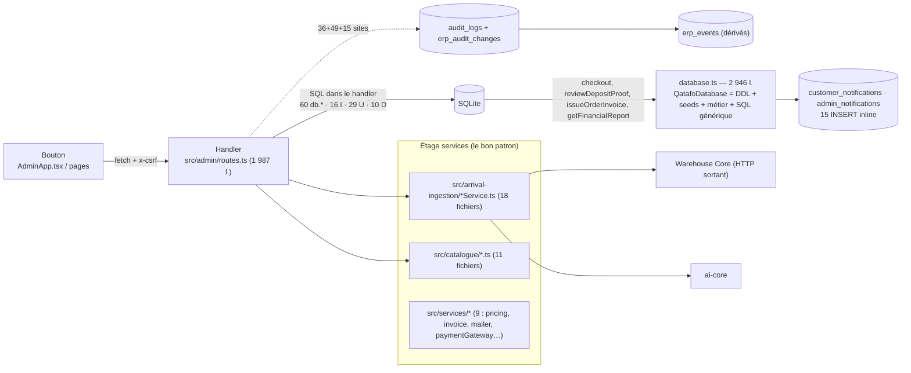
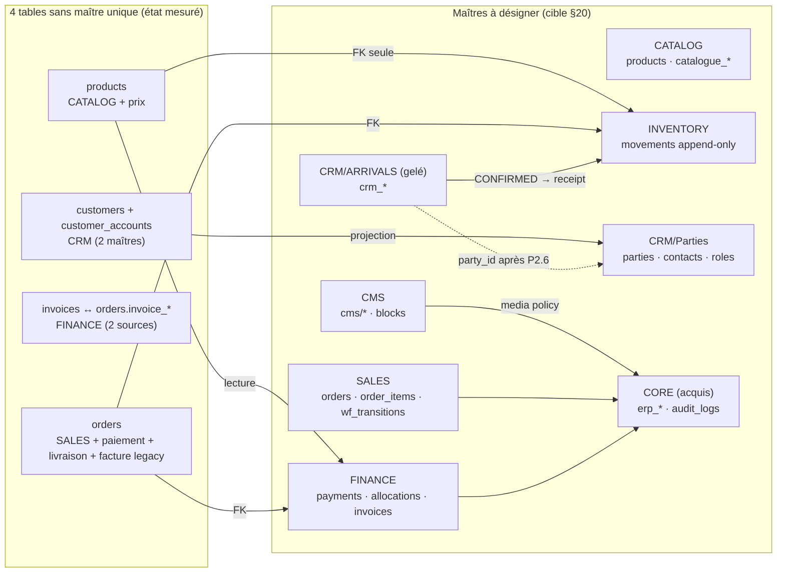
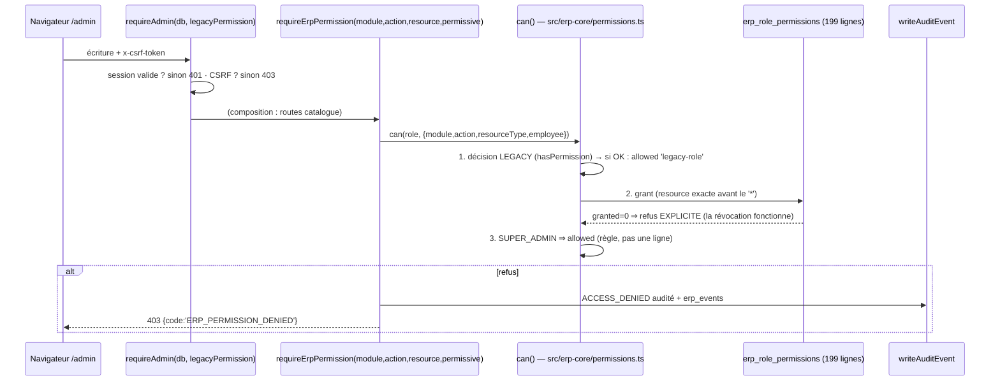
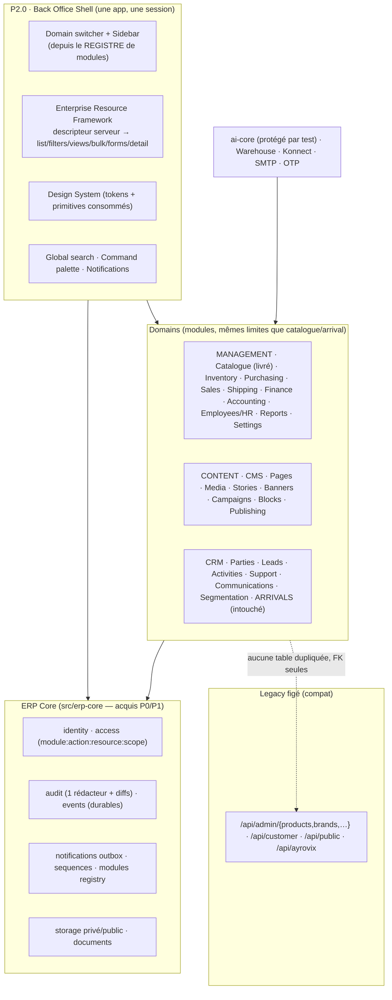

# AYROVI — BACK OFFICE TRANSFORMATION · DISCOVERY

**Phase : DISCOVERY UNIQUEMENT. Aucune ligne de production n'a été modifiée par ce travail.**
Date : 2026-09-05 · Branche `main` · `HEAD` observé : `aed5c48` · Version applicative `3.10.4`
Auteurs des sources lues intégralement : `AUDIT_ERP_2026-09-05.md` (106 108 octets, 995 l., commit audité `f4c96a1`), `ERP_CORE_P0_P1_REPORT.md`, `ERP_CORE_P1_CLOSURE_REPORT.md`, `P2_1_CATALOGUE_INVENTORY.md`, `P2_1_CATALOGUE_REPORT.md`, **et le code actuel** (serveur, base, routes, permissions, tests, front admin).

> Règle appliquée partout : **le code et les rapports font foi, pas cette commande.**
> Chaque fois qu'une affirmation de la consigne MASTER COMMAND V2 divergeait de la réalité mesurée,
> l'écart est écrit dans le texte et enregistré dans le registre §33 (`UNKNOWN/CONFLICT`). Trois
> écarts majeurs sont déjà signalés ici : **le nombre de pages (37 mesurées, pas 28)**, **le
> positionnement de P2.1 Catalogue dans votre séquence (il est déjà livré et poussé)**, et
> **l'état des tokens de design (globalement importés, mais ignorés par l'admin)**.

---

## 1. Executive Summary

**Ce qui existe réellement.** Un seul processus Express + un seul SQLite, **270 définitions de routes**,
**88 tables bootées**, **62 431 lignes TS/TSX**, **421 tests verts**. À l'intérieur : un site e-commerce
international complet (Lens, panier, checkout, compte client, assistant vocal), un vrai CMS
(21 tables, moteur de descriptors serveur), un CRM d'ingestion d'arrivages remarquablement abouti
(`src/arrival-ingestion/` : 20 fichiers, 5 387 lignes, 45 endpoints, 14 tables, jobs durables à lease,
SCD-2, gates de classification, dispatch idempotent vers Warehouse Core), et — depuis P0/P1 — une
**fondation ERP partagée** (`src/erp-core/`, 10 fichiers, 1 906 lignes) qui fournit déjà identité employé,
permissions `module:action:resource:scope` **en données**, audit unique avec diff par champ et journalisation
des refus et des lectures sensibles, registre de modules (21 entrées), événements durables, notifications et
séquences de numérotation. P2.1 a ajouté le catalogue canonique (12 fichiers, 2 509 lignes, 27 endpoints,
3 écrans admin) sans dupliquer de système.

**Le vrai problème n'est donc pas l'absence d'ERP : c'est l'absence de CONTENEUR.** Il n'existe pas de
coquille unique, pas de framework de ressource partagé entre les 37 écrans, pas de système de design
consommé par l'admin, pas de frontière de module appliquée par la CI ailleurs que pour l'IA, et la business
logic est répartie sur trois étages (`src/db/database.ts` 2 946 lignes qui contiennent le checkout et la
facturation, les handlers de routes, et les services du seul module arrival-ingestion). Les capacités sont
là ; **elles ne sont pas encore organisées en Back Office.**

**Ce que je recommande.** Une phase **P2.0 « Back Office Foundation »** — coquille, navigation par domaines,
framework de ressource unifié, système de design, workspace de détail, recherche/commandes/notifications,
et test d'architecture étendu — **sans toucher aux capacités**, puis les migrations incrémentales par
domaine dans l'ordre des dépendances réelles (§34/§35). L'ordre que vous proposez (§28) part de zéro ;
l'état mesuré est déjà à « P2.1 Catalogue fait ». **Proposition : P2.0 maintenant, et le catalogue livré
devient le premier client du nouveau framework** (ses 3 écrans sont ré-hébergés dans la coquille, son API
ne bouge pas) — c'est exactement le chemin `Adapter → New UI → Old logic` de votre §26, sans réécriture.

**À préserver sans discussion** : `arrival-ingestion` tel quel (patron à imiter, pas à refactoriser) ; la
règle de P1 « une décision legacy ne peut pas être affaiblie par le nouveau moteur » ; `/uploads` en
default-deny (`PUBLIC_UPLOAD_DIRS = ['hero']`) ; les 421 tests ; la propriété unique de chaque donnée.

---

## 2. Current System Map

```mermaid
graph TD
  subgraph Browser["Un seul build Vite → public/, servis par express.static"]
    PUB["PublicApp · /<br/>App.tsx 645 l., 13 sections"]
    ADM["AdminApp · /admin<br/>753 l. · 37 entrées de nav · 6 groupes"]
    CUS["Customer account · Assistant · Ayrovix Lens · Social"]
  end
  subgraph Server["src/server.ts (374 l.) — un processus, une instance db"]
    R1["/api/admin · 94 routes<br/>src/admin/routes.ts 1 987 l."]
    R2["/api/admin/arrival-ingestion · 45<br/>src/arrival-ingestion/* 5 387 l."]
    R3["/api/admin/core · 17<br/>src/erp-core/* 1 906 l."]
    R4["/api/admin/catalogue · 27<br/>src/catalogue/* 2 509 l."]
    R5["/api/customer · 39"]
    R6["/api/public · 26 · /api · 7"]
    R7["/api/ayrovix · 9 (ratelimit seul)"]
    R8["/api/assistant + /api/voice · 6 définies, 2 montages"]
    UP["/uploads · garde default-deny (P0)"]
  end
  subgraph Data["Un seul fichier SQLite (better-sqlite3, WAL, foreign_keys ON)"]
    T1["88 tables · 14 crm_* · 10 erp_* · 5 catalogue_*<br/>10 customer* · 4 hero* · 4 lens* · 3 admin* · 1 audit_logs · …"]
    DB["QatafoDatabase · src/db/database.ts 2 946 l.<br/>DDL + seeds + helpers + CHECKOUT + FACTURATION"]
  end
  subgraph Ext["Dépendances externes (83 variables d'env, 0 feature flag)"]
    E1["Warehouse Core (HTTP, x-api-key, idempotency-key)"]
    E2["Konnect (paiement) · SMTP (mailer) · Twilio OTP"]
    E3["Anthropic · OpenAI · Gemini · Groq · scrapers · Pexels/Pixabay"]
  end
  PUB --> R5 & R6 & R7 & R8
  ADM --> R1 & R2 & R3 & R4
  R1 --> DB
  R2 --> DB
  R4 --> DB
  R3 --> DB
  R1 --> UP
  R2 --> E1
  R5 --> E2
  R8 --> E3
```



**Lecture des nombres** (tous mesurés, même méthode que l'audit) : les 270 définitions de routes se
décomposent en `admin 94 · arrival-ingestion 45 · customer 39 · catalogue 27 · public 26 · core 17 ·
ayrovix 9 · api 7 · assistant 6`. L'audit de référence comptait **226** endpoints : la différence est
entièrement explicable par P1 (`/core`, 17) et P2.1 (`/catalogue`, 27) — **226 + 17 + 27 = 270** ✓. Les
routes d'**écriture** admin sont 54 (40 lectures), contre 51 au moment de l'audit : le socle a grandi, sa
forme n'a pas changé.

**Le graphe de dépendances est une étoile, pas un domaine** : chaque module reçoit `db` nu
(`server.ts:199-205`) et écrit son SQL soit dans le handler (`src/admin/routes.ts` recompté ce jour : **60** appels `db.get/all/prepare/run`,
16 `INSERT`, 29 `UPDATE`, 10 `DELETE`), soit dans ses services (`arrival-ingestion`, `catalogue`).
Les 4 tables `ayrovix_*` sont créées **hors** de `database.ts` (`ensureAyrovixReviewRequestsTable()` +
`WeakSet`) — 92 `CREATE TABLE` dans le code, **88** tables réellement présentes après boot : l'écart est
entièrement dû à ce schéma paresseux (§30, finding `DUP-07`, et anomalie D12 de l'audit, **toujours vraie**).

**La seule frontière appliquée par un outil** reste `tests/ai-architecture-boundaries.test.ts` (interdit
URL/SDK/imports provider hors des adapters, allowlist gelée de 2 fichiers). Aucune équivalent n'existe pour
CRM, Catalogue, Finance, CMS : c'est la première pièce de P2.0 (§27.10).

---

## 3. Existing CRM Capability Inventory

Format imposé par votre §5, appliqué aux 22 capacités qui portent le système. (Frontend = fichier réel,
Backend = fichier + ligne, Database = tables, Permissions = gates vérifiés dans le code.)

**CAP-01 · Arrival Ingestion (le cœur CRM)**
Current Location: `src/arrival-ingestion/` · Frontend: `client/src/admin/ArrivalIngestionPage.tsx` 879 l. + `ArrivalShipments.tsx` 307 l. + `arrival-ingestion.css` 333 l. · Backend: `routes.ts` (45 endpoints, **0 SQL et 0 audit** — le handler valide et délègue) → **13 `*Service.ts`** + normaliseur, `arrivalExtractionSchema`, `storeExtractionStrategy`, `storeProfiles`, `types`, `errors` · Database: 14 `crm_*` ; `crm_extracted_products` 49 colonnes dont `is_current`/`superseded_at`/`superseded_by_job_id`/`manual_edits`/`field_evidence`/`review_reasons` (SCD-2) ; `crm_extraction_jobs` 25 colonnes dont `state`,`attempt`,`retry_at`,`worker_id`,`heartbeat_at`,`lease_expires_at` · API: `/api/admin/arrival-ingestion/*` · Business Logic: `extractionJobService` (lease + `recoverPending()`), `categoryClassificationService` (+ gate `classification_required`), `productExtractionNormalizer`, `shipmentService`, `warehouseDispatchService` (`card_id = card_${arrivalClientId}`, HTTP + `idempotency-key`) · Permissions: `requireAdmin(db,'commerce:*')` sur les 45 · Audit: **35 sites `recordAdminAudit`, tous dans les 11 services** (0 dans `routes.ts`) · Events: `erp_events` dérivés de l'audit · Notifications: aucune (le dispatch est HTTP sortant) · Integrations: Warehouse Core, `ai-core` (workload `arrival-ingestion`) · Current Users: ADMIN / CONTENT_MANAGER / SUPER_ADMIN · Dependencies: `QatafoDatabase`, `ai-core`, `crm_schema_migrations` (backup vérifié = pré-condition du migrate) · Risk: **élevé si touché** ; quasi nul si on n'y touche pas · Future Domain: CRM · Future Module: `CRM/Arrivals` · Recommended Action: **KEEP — patron de référence à imiter ; aucune réécriture, aucun déplacement de fichiers en P2.0** (seule évolution prévue : `goods_receipts` en P-Inventory, par FK ajoutée).

**CAP-02 · Clients (identité double)**
Current Location: `customers` (9 col., `phone UNIQUE`) **et** `customer_accounts` (13 col.) · Frontend: page `customers`, 2 onglets + modale + 2 sous-tables (`AdminApp.tsx:588-594`) · Backend: `GET /admin/customers(/:id)`, `GET /admin/customer-accounts`, `PUT /customer-accounts/:id/status` · Business Logic: **deux créateurs** — `createOrderFromCart` (`database.ts:2460`, unification par `normalizeCustomerPhone()` regex `+216`/`00216`) et `arrivalClientService.createAndAdd` (~322, **seconde implémentation de la même règle**) · Permissions: `commerce:read` · Audit: oui (mutations admin) · Events: dérivés · Current Users: ADMIN, ORDER_MANAGER · Dependencies: `orders` porte `customer_id` (RESTRICT) **et** `account_id` (SET NULL) · Risk: **foncier** — c'est le nœud du futur modèle `parties` · Future Domain: CRM · Module: `CRM/Parties` · Action: **MERGE progressif** (additif : `parties`/`party_contacts`/`party_roles` + vues, jamais de suppression des deux tables).

**CAP-03 · Support / tickets**
`assistant_support_tickets` 14 col., `assigned_to → admin_users`, `status`/`priority` en CHECK figés · Frontend: page `assistant-support` · Backend: `GET/PUT /admin/assistant-support/:id` · Écrit par l'IA (`escalate_to_human`, seul write-tool autorisé) · Permissions `commerce:read/write` · Audit: oui · **Déficits**: pas de SLA, pas de canal, pas de messages multiples, pas de pièces jointes · Future Domain: CRM · Module: `CRM/Support` · Action: **IMPROVE/EXTEND** (ticket générique, l'actuel devient une source).

**CAP-04 · Commandes (OMS)**
`orders` 40 col. + `order_items` 27 col. (dont `product_id` **sans FK**) + `order_status_history` · Frontend: `OrdersPage` (liste, détail en modale, livraison, acomptes) · Backend: `src/admin/routes.ts:1391-1441` · **Business Logic dans le handler** : machine à états codée en dur (10 statuts ; `DELIVERED`/`CANCELLED` terminaux ; `SHIPPED` exige carrier+tracking via `/delivery`) ; `PUT /orders/:id/payment` **refuse tout paiement manuel** (409 explicite, `routes.ts:1424-1430`) · Permissions: `commerce:*`, `payments:*` · Audit: oui (dont le refus, corrigé en P0) · Events: dérivés · Future Domain: MANAGEMENT · Module: `Sales` · Action: **RESTRUCTURE** (même transitions → `workflow_definitions` en données ; l'API ne change pas).

**CAP-05 · Checkout client**
Backend: `createOrderFromCart` (`database.ts:2460-2570`) · Database: **une transaction, 9 tables écrites** — `customers` (upsert), `orders`, `order_items`, `order_status_history`, `payments` (1/commande, contrainte `order_id UNIQUE`), `deliveries`, `customer_notifications`, `admin_notifications` (+ lecture `cart_items`, `customer_accounts`, `pricing_config`, `customs_categories`) · Side effects d'un seul appel client : validation compte, unification téléphone, calcul d'acompte/remise carte, 2 notifications, snapshot de prix JSON **dupliqué** sur commande et lignes · **Audit: aucun ; `erp_events`: aucun** (seul le chemin admin est tracé) · Future Domain: MANAGEMENT/Sales · Action: **RESTRUCTURE** — extraire en `sales/checkout.service.ts`, **ajouter l'événement + l'audit d'état** (un événement de cycle de vie, pas un audit par requête), sans changer le contrat `POST /api/checkout`.

**CAP-06 · Paiements / justificatifs**
`payments` (1 UNIQUE par commande) + `payment_transactions` (n, `transaction_number UNIQUE`, payload tronqué à 10 000) + `payment_proofs` (file de revue indexée, `rejection_reason` obligatoire) · Cycle preuve → revue → confirmation **sûr** (`reviewDepositProof`) · Konnect via `paymentGateway.ts` · Permissions `payments:write` · Audit: oui · Action: **KEEP + EXTEND** (multi-lignes + allocations ⇒ Finance ; ne pas casser l'UNIQUE existant, l'étendre par table d'allocations).

**CAP-07 · Facturation**
`invoices` 9 col., `order_id UNIQUE` (1 facture/commande, pas de lignes), statut binaire `ISSUED|VOID`, numéro `INV-<année>-<COUNT+1>` (trous/réutilisations possibles), PDF maison (`simplePdf.ts` 112 l. + `invoice.ts` 299 l.) **et** colonnes fantômes `orders.invoice_number`/`invoice_path` maintenues « read-compatible » · Fichiers : écrits sous la racine legacy, servis via `data/fileAccess.ts` (contrôlé + audité depuis P0) · Action: **EXTEND** (séquence `erp_sequences`, DRAFT/SENT/PAID/VOID, lignes, avoirs) ; les colonnes legacy passent en lecture seule, **jamais supprimées en phase Discovery**.

**CAP-08 · Dépenses / résultat**
`expenses` 9 col., 7 catégories CHECK, `created_by` **sans FK**, **DELETE physique** (`reports:write`) ; `getFinancialReport(from,to)` = 2 SUM + soustraction · Action: **IMPROVE** (soft delete, FK, rattachement fournisseur) puis **RESTRUCTURE** vers un vrai ledger (§34 P-Finance) — c'est le seul module classé `Basic Finance` par l'audit, à juste titre.

**CAP-09 · Catalogue** (livré en P2.1)
`products` **canonique** + 6 colonnes additives + `catalogue_variants` (SKU `UNIQUE COLLATE NOCASE` en base) + `catalogue_categories` (arbre, anti-cycle) + `catalogue_attributes`/`_values` + `catalogue_media` (références publiques uniquement) · Backend `src/catalogue/*` (services épais, handlers minces, **patron arrival-ingestion appliqué**) · API `/api/admin/catalogue/*` 27 routes, erreurs 400/403/404/409 · Permissions 60 grants + `approve` séparé · Audit + événements : 100 % des mutations · Frontend : `CataloguePages.tsx` 641 l., 3 écrans · Action: **KEEP · à ré-embarquer dans le framework de ressource (P2.0), API inchangée.**

**CAP-10 · Prix & douane**
`pricing_config` + `customs_categories` (source de vérité) → recalculs écrits dans `products.converted_price/customs_fee/shipping_fee/service_fee/final_price` par `recomputeProductPricing` (`admin/routes.ts:1297`) et snapshots JSON sur commande+lignes : **trois représentations du même prix** · Frontend: page `pricing` · Action: **RESTRUCTURE** (le recalcul devient un service `catalog/pricing` avec une seule écriture, snapshots conservés — ce sont de bons immuables).

**CAP-11 · CMS par descriptor**
`resources` serveur (9 : `arrivals, products, promotions, stories, news, brands, hero-slides, announcements, ai-knowledge`) × `ResourceConfig` 13 clés (table, module, prefix, permission, **readPermission ajouté en P1**, fields, required, searchable, sortable, defaultSort, jsonFields, enums, softDelete) → 5 endpoints + pagination + recherche LIKE + tri allowlist + `sanitizePayload` en allowlist + bornes de taille + dates normalisées + suppression logique · Client: `ResourceDefinition`/`FieldDefinition` (8 types de champs) **redupliqués à la main** dans `AdminApp.tsx:48-139`, **aucun endpoint de descripteur** · Action: **EXTEND → c'est le futur Enterprise Resource Framework** (§13, §27).

**CAP-12 · CMS pages métier**
12 écrans à la main (`trust-bar`, `lens-hero`, `hero-content`, `home-blocks`, `hero-visuals`, `publications`, `reels`, `story-publishers`, `magazine-agent`/`magazine-drafts`, `settings`, `interface`, `design`) ; 4 modèles de persistance coexistants ; **4 tables pour le Hero** ; upload en 4 voies (`POST /uploads` dataURL ×4 usages, `lensUpload`, `heroUpload`, import CRM) · Action: **MERGE** vers le framework + namespace `cms/*`.

**CAP-13 · Social / récits**
`publications`, `reels`, `story_publishers`, `story_interactions` + `stories`/`news_items` (CMS) + `magazine_drafts` (IA) qui **écrit dans** `news_items` · 2 routes publiques volontairement `410 Gone` · Action: **RESTRUCTURE** (frontière de propriété éditoriale, un seul chemin de publication, relecture humaine **forcée** — aujourd'hui seulement commentée).

**CAP-14 · Lens / Ayrovix (IA grand public)**
`src/ayrovix/` 2 794 l./17 fichiers · 9 endpoints **sans authentification** (ratelimit par IP + exemption `GET /history`) · quota payant, `AYROVIX_QUOTE_SECRET` statique · tables `ayrovix_*` créées hors `database.ts` · Action: **IMPROVE** (ajouter l'identité + journalisation des lectures payantes — point A6/S7 de l'audit, non traité car hors P0/P1) · Future Domain: MANAGEMENT/Integrations.

**CAP-15 · Assistant & voix**
`src/assistant/` 2 646 l. · router monté sur **deux chemins** (`/api/assistant`, `/api/voice`) · Gemini Live, TTS/STT (OpenAI/Groq), escalade humaine · `assistant_tool_audit` + `assistant_tool_idempotency` (patron d'idempotence réutilisable pour les actions ERP) · Action: **KEEP** · Future Domain: MANAGEMENT/AI.

**CAP-16 · IA (socle)**
`src/ai-core/` 2 314 l. : `contracts.ts`, `policy.ts` (circuit breaker), `shadow.ts`, `execution.ts`, adapters `anthropic`/`openai`/`legacy` · protégé par test d'architecture · Action: **KEEP INTACT** (ne rien « refactoriser » ; brancher les nouveaux workloads par déclaration).

**CAP-17 · Identité & comptes**
`admin_users` (scrypt, sessions HttpOnly `Path=/api/admin`, TTL 8 h, CSRF rotatif, anti-suicide) + `erp_employees` (`EMP-000001` par séquence, 1:1, le login n'est **jamais** touché par les écrans ERP) + `erp_organizations/branches/departments/teams` · Frontend: `ErpCorePages.tsx` 438 l., 6 écrans · Action: **KEEP/EXTEND** — l'ERP Core reste le maître d'identité ; `admin_users` = credentials.

**CAP-18 · Autorisation**
Moteur P1 `module:action:resource:scope` **en données** (`erp_role_permissions`, 199 lignes seedées, `origin` SEED/MANUAL, révoquables) + décision héritée prioritaire (l'activation ne peut pas verrouiller) + `requireErpPermission` · **trois façades** conservées : `requireAdmin(db, perm)` (legacy, porte le CSRF), `requireErpPermission`, et leur composition (catalogue) · Action: **EXTEND** — ajouter la matrice au client (voir le défaut récurrent : les boutons restent cliquables et renvoient 403) + `field`-level (masquage/lecture seule pour Finance).

**CAP-19 · Audit**
Un rédacteur (`writeAuditEvent`) derrière 3 API (100 sites d'appel) ; +11 colonnes additives + `erp_audit_changes` (diff par champ, avant-image sur suppression) ; lectures de documents sensibles et export CSV tracés ; couverture admin 16 trous → **0** (P0) · Frontend: écran `Audit (ERP)` ; l'ancien `Journal d'audit` affiche encore des placeholders · Action: **EXTEND + MERGE des écrans** (un seul centre d'audit, vrai diff, filtres employé/module/enregistrement).

**CAP-20 · Événements & notifications**
`erp_events` durable + bus in-process, 1 événement dérivé par écriture auditée (2 émissions explicites ailleurs) ; `erp_notification_deliveries` + helpers `notifyAdminUser`/`emitDerivedEvents` — **0 appel du helper de notification** ; en parallèle **15 INSERT inline** (`admin_notifications` ×3, `customer_notifications` ×12) · Action: **EXTEND → brancher l'outbox** (l'inline est le doublon à résorber ; c'était explicitement différé de P1).

**CAP-21 · Fichiers & stockage**
Racine privée `data/private/documents/*` (0700) + garde `/uploads` default-deny + repli de lecture legacy + `src/documents/fileAccess.ts` · **trois calculs de racine** (audit D11) : `server.ts` cwd, `services/invoice.ts` `dirname(DATABASE_PATH)`, `services/heroVisual.ts` cwd — réconciliés **en pratique** sur Render, pas ailleurs · Action: **IMPROVE** (une seule fonction de résolution, testée, sinon les factures sortent du disque sauvegardé).

**CAP-22 · Rapports & exports**
`GET /admin/reports/orders.csv` (10 000 lignes, audité `ACCESS` depuis P0), dashboard (revenus/statuts/sources), `getFinancialReport` · Action: **IMPROVE → MERGE** dans un module Reports avec datasets et vues sauvegardées (§27).

Capacités **absentes du code et demandées par la cible** (à créer, pas à migrer) : Leads, Activities, Tasks, Notes multi-auteurs, Segments, Opportunities · Inventory (quantités/emplacements/mouvements) · Purchasing/suppliers (le mot « supplier » n'existe que comme texte dans `crm_extracted_products`) · Workflow engine en données · Comptabilité (plan, journal, périodes, avoirs, rapprochement) · Returns/RMA (aucune table, aucun endpoint, et aucune occurrence de « rembourse* » dans `client/src/components/CartDrawer.tsx` vérifiée ce jour : la capacité manque au code **et** au vocabulaire).

---

## 4. Capability Classification

Une classe **par capacité** (§6), déduite du §3. Répartition mesurée sur les 22 capacités ci-dessus :
**KEEP 6 · IMPROVE 6 · RESTRUCTURE 5 · MERGE 3 · DEPRECATE 0 · UNKNOWN 2**.

| Capacité | Classe | Pourquoi (preuve) | Condition de sortie |
|---|---|---|---|
| CAP-01 Arrival ingestion | **KEEP** | idempotence par `source_hash`, jobs à lease/`recoverPending()`, SCD-2, gates, dispatch idempotent ; SQL absent des handlers | Interdiction de réécrire ; évolution par tables/FK ajoutées |
| CAP-09 Catalogue | **KEEP** | P2.1 livré et testé (48 tests), patron service/handler, DB-level uniqueness | Ré-embarquer dans le framework UI en P2.0 |
| CAP-11 CMS descriptor | **KEEP** (→ étendu) | 9 écrans pour ~0 code UI, allowlists, soft delete | Devient le socle du Resource Framework |
| CAP-16 ai-core | **KEEP** | frontière appliquée par test, circuit breaker, shadow | Ne pas toucher ; déclarer les nouveaux workloads |
| CAP-17 Identité/organisation | **KEEP** | `EMP-*` 1:1 sans toucher au login ; arbre org | Ajouter les portées de scope utiles aux écrans |
| CAP-19 Audit (écriture) | **KEEP** | 1 rédacteur, diffs, refus et lectures tracés, 0 trou admin | Écran unique + append-only (trigger/`UPDATE` interdit) |
| CAP-02 Clients | **MERGE** | 2 tables, 2 implémentations de la même règle d'unification | `parties` additif + vues, dédoublonnage chiffré |
| CAP-12 CMS pages métier | **MERGE** | 4 modèles de persistance, 4 tables Hero, 4 voies d'upload | namespace `cms/*` + descriptors |
| CAP-22 Reports | **MERGE** | dashboard + CSV + `getFinancialReport` en trois endroits | datasets + exports journalisés |
| CAP-04 Commandes | **RESTRUCTURE** | machine à états dans `routes.ts:1431-1441` | transitions en données, API stable |
| CAP-05 Checkout | **RESTRUCTURE** | métier dans `database.ts:2460` ; 9 tables, 0 événement | service dédié + événements de cycle de vie |
| CAP-10 Prix | **RESTRUCTURE** | prix dans 3 représentations sans contrainte | un service, un chemin d'écriture |
| CAP-13 Social/magazine | **RESTRUCTURE** | 3 couches éditoriales, `magazine_drafts → news_items` | une frontière de publication + relecture forcée |
| CAP-21 Racines de fichiers | **IMPROVE** | 3 calculs de chemin (D11) | une fonction unique + test |
| CAP-14 Ayrovix public | **IMPROVE** | 9 endpoints non authentifiés, quota payant | identité + audit de lecture |
| CAP-03 Support | **IMPROVE** | CHECK figés, pas de SLA/canal/messages | ticket générique, l'actuel = source |
| CAP-06 Paiements | **IMPROVE** | `order_id UNIQUE` = 1 paiement/commande | table d'allocations additive |
| CAP-07 Factures | **IMPROVE** | numéro par `COUNT+1`, statut binaire | séquence + cycle ; legacy en lecture seule |
| CAP-08 Dépenses | **IMPROVE** | DELETE physique, pas de FK, profit = 2 SUM | soft delete + ledger en P-Finance |
| CAP-18 Autorisation | **IMPROVE** | matrice non consommée par l'UI (boutons → 403) | `permissions/me` consommé partout |
| CAP-20 Notifications | **IMPROVE** | helper à 0 appel contre 15 inserts inline | brancher l'outbox, résorber l'inline |
| `UNKNOWN-006` : `crm_stores` = marketplace **ou** fournisseur ? | **UNKNOWN** | le code l'appelle « store/supplier » (`storeExtractionStrategy.ts:12`) | décision produit (§33) |
| `UNKNOWN-007` : `promotions.usage_count`/`promo_code` | **UNKNOWN** | 0 incrémentation localisée dans `src/` | vérifier en prod avant de classer |

**DEPRECATE : aucun composant.** Conséquence directe de l'audit §7.3 (aucune table morte sur 73 à
l'époque, 0 aujourd'hui) et de votre §31 : la liste des candidats à l'abandon est vide, seulement des
**legacy en sursis** (`orders.invoice_number`/`invoice_path`, 4 index déclarés deux fois, 2 tables créées
deux fois, `crm_schema_migrations` mono-clé) → statut `ADAPTER/READ-ONLY`, jamais `DELETE`.

---

## 5. Business Logic Map

Le point structurel, mesuré : la logique vit à **trois étages**, et l'étage du milieu (les handlers) est
le plus peuplé.



**Chaîne complète d'un acte critique n° 1 — `PUT /api/admin/orders/:id/status` :**
contrôle CSRF (`requireAdmin`) → permission `commerce:write` → lecture de la commande → **validation par la
machine à états codée en dur** (10 statuts ; `SHIPPED` refusé si `carrier`/`tracking_no` absents ;
`DELIVERED`/`CANCELLED` terminaux) → `UPDATE orders` → `INSERT order_status_history` → notifications
admin en ligne → audit + `erp_events` (`sales.status-changed`) → réponse `{success,data}`.
**Aucun** ajustement de stock (impossible : il n'existe pas), **aucun** déclenchement de facture
(c'est `POST /orders/:id/invoice`, séparé). Un seul bouton, **5 tables touchées, 1 trou : pas de
réservation ni de libération** — c'est précisément ce que P-Inventory branchera.

**Chaîne n° 2 — `POST /api/checkout` (client, aucune session admin) :** 1 `db.transaction` →
validation du compte (`ACCOUNT_UNAVAILABLE`) → upsert `customers` (regex téléphone) → contrôle de prix par
ligne (`INVALID_CART_PRICE`) → calcul acompte + remise carte → **9 tables écrites** (cf. CAP-05) → 2
notifications inline → retour. **Zéro ligne d'audit, zéro événement.** Un ERP digne de ce nom doit pouvoir
répondre « qui a créé cette commande et quand, côté système » : aujourd'hui seul `created_at` répond.

**Chaîne n° 3 — import d'un document d'arrivage :** `POST /sources` → `source_hash` SHA-256
(UNIQUE = import deux fois impossible) → création job `QUEUED` → `worker_id`+`lease_expires_at` + heartbeat
pendant l'extraction → `ai-core` (workload dédié) → normalisation → `is_current=0`/`superseded_by_job_id`
pour les versions remplacées (SCD-2) → gate de classification → `REVIEW` → `CONFIRMED` → `dispatch`
(`card_id` déterministe, `idempotency-key`, `attempts`, `SEND_FAILED` rejouable) → audit par service.
**C'est le patron que tout le reste doit suivre** ; aucun autre domaine ne l'atteint aujourd'hui.

**Règles métier « orphelines » à relocaliser** (liste non négociable pour P2.0+) :

| Règle | Où elle vit | Où elle devrait vivre |
|---|---|---|
| transitions de commande | handler `routes.ts:1431` | `sales` service + définition en données |
| prix produit (douane, frais, marge, express) | `services/pricing.ts` **appelé depuis** le CRUD générique `:1297` | `catalog/pricing` service, une écriture |
| unification téléphone client | 2 implémentations (`database.ts` + `arrivalClientService`) | `crm/parties` une seule fois |
| émission de facture + PDF | `database.ts:2923` (`issueOrderInvoice`) + `services/invoice.ts` | `finance/invoicing` |
| revue de justificatif (4-eyes) | `database.ts` `reviewDepositProof` | `finance/payments` + gate `approve` |
| statut `PARTIALLY_PAID` | **déclaré dans 3 CHECK, 0 poseur** (audit U5, revérifié) | à poser par les allocations (P-Finance) |
| numérotation AYR-/PAY-/TXN-/INV- | `randomInt` / `COUNT+1` dans `database.ts` | `erp_sequences` (existe, utilisé par EMP-/PRD-) |

---

## 6. Data Ownership Map (état réel, prouvé)

| Table | Propriétaire actuel | Domaine métier | Écrit par | Lu par | Criticité | Risque de migration | Propriétaire cible |
|---|---|---|---|---|---|---|---|
| `products` | ambigu : CRUD admin générique **et** extraction IA (via `crm_extracted_products`) | Catalogue **+** Prix (colonnes `final_price`…) | `admin/routes.ts` (legit), `catalogue/products.ts` | public, customer, magazine, ayrovix, promos | **Critique** | moyen (miroirs legacy `category`/`brand_name`) | **Catalogue** (maître), prix en lecture seule dérivée |
| `catalogue_variants` | `src/catalogue` | Catalogue | catalogue uniquement | catalogue (+ futur Stock) | élevée | quasi nul (neuf) | Catalogue |
| `orders` | `database.ts` (checkout) + `admin/routes.ts` (statut) | Ventes **+** Paiement **+** Livraison **+** facture legacy | 2 écriteurs | admin, client, CSV, facture | **Critique** | élevé si on casse les FK souples | **Sales** ; `invoice_*` legacy → lecture seule |
| `payments` | `database.ts` | Finance | checkout + Konnect + revue | rapports, compte client | critique | **contrainte de modèle** (`order_id UNIQUE`) | Finance (allocations additives) |
| `invoices` | `services/invoice.ts` + `database.ts:2923` | Finance | 2 endroits | client, admin, disque | élevée | doublon avec `orders.invoice_*` | Finance, unique |
| `customers` / `customer_accounts` | **personne ne les unifie** | CRM vs Compte e-commerce | checkout, arrivals, admin | les deux + `orders` | **critique** | **élevé** (2 identités, fusion) | **CRM/Parties** (les 2 deviennent des projections) |
| `crm_*` (14) | `src/arrival-ingestion` | CRM/Arrivages | ses services uniquement | son écran + dispatch | élevée | **aucun si non touché** | CRM/Arrivals (inchangé) |
| `audit_logs` + `erp_*` | `src/erp-core` | Core | rédacteur unique | admin, écrans ERP | critique | nul (additif) | ERP Core |
| `arrivals` (CMS) vs `crm_arrivals` | CMS vs CRM | Vitrine vs Exploitation | descriptors vs services | les deux, séparés | moyenne | **le mot veut dire deux choses** | renommer dans l'usage (`cms_campaign_arrivals` vs `erp_inbound_arrivals`), **ajouter** une liaison, ne jamais supprimer |
| `deliveries` vs `crm_shipments`+`_cartons` | OMS vs CRM | Transport client vs cartons d'arrivage | 2 chemins | 2 écrans | moyenne | elles ne se parlent pas | SHIPPING relie les deux (`shipment_package`), additif |
| `stock_status` (3 valeurs) | `products` | **pas** du stock | CRUD admin | vitrine | moyenne | fausse assurance si on l'appelle stock | INVENTORY (quantités dérivées, `stock_status` calculé) |
| `settings` (+ 3 tables `*_settings`) | CMS/admin | Paramètres **et** réglages métier (hero, lens, trust bar) | 1 endpoint + handlers dédiés | tout | moyenne | 4 modèles pour un concept | `erp_settings` par namespace (additif) |



**Règle à adopter (§8 de la commande, à valider)** : une table, un maître, **une** route d'écriture ; les
domaines voisins ne gardent que des FK ou des snapshots immuables (le `pricing_snapshot` actuel est le bon
réflexe, à généraliser). Sur les 12 lignes ci-dessus, **4 violent déjà cette règle** (`products`, `orders`,
`invoices`, `customers`) : c'est là que la valeur d'architecture est la plus forte, et le risque de
casse le plus concentré.

---

## 7. API Map

**Par domaine, avec le statut de l'endpoint type.** 270 définitions ; les contrats sont hétérogènes sur 3
axes (confirmés en relisant le code) : enveloppe (`{success,data}` admin vs `{code,error}` arrival vs nu sur
`/api/ayrovix`), verbe (mesuré : `admin` 22 PUT / 0 PATCH · `catalogue` 5 PUT / 0 PATCH ·
`arrival-ingestion` 0 PUT / **6 PATCH** · `core` 0 PUT / 1 PATCH — aucune règle écrite), et permission
(portée par la **route**, jamais par la ressource, sauf catalogue/core).

| Domaine | Base de routes | Auth | Permission | SQL dans le handler | Audit | Verdict de forme |
|---|---|---|---|---|---|---|
| Core | `/api/admin/core` (17) | session+CSRF | `requireErpPermission` | 0 (services) | oui (écrans de lecture) | **conforme au patron cible** |
| Catalogue | `/api/admin/catalogue` (27) | session+CSRF | `requireAdmin ⊕ requireErpPermission` | 0 (services) | mutations + refus | **conforme** |
| CRM/Arrival | `/api/admin/arrival-ingestion` (45) | session | `requireAdmin(db,'commerce:*')` | **0** | 35 sites, dans les services | conforme, namespace à conserver |
| Sales | `/api/admin/orders*`, `/promotions*`, CRUD générique (94 au total dans `/api/admin`) | session | legacy 12 permissions | **massif (111+)** | 49 sites | **à RESTRUCTURER** (découpage par module, chemins conservés) |
| Finance | `/api/admin/reports*`, `/payments*`, `/invoices*`, `/expenses/:id` | session | `payments:*`, `reports:*` | moyen | oui | à isoler (`/api/admin/finance`) |
| CMS | `/api/admin/{9 resources}` + 12 pages métier | session | `content:*` (`ai-knowledge` en `settings:write`) | moyen | partiel | à namespace + descriptors |
| Support | `/api/admin/assistant-support*` | session | `commerce:*` | léger | oui | à déplacer vers CRM |
| AI | `/api/ayrovix` (9, **sans auth**), `/api/assistant`+`/api/voice` (6) | ratelimit / session client | aucune | – | outil-audit côté assistant | à protéger (IMPROVE) |
| Public | `/api/public` (26), `/api` (7) | public / session client | – | 34 SELECT | non (sauf mutations limitées) | conserver, geler les contrats |
| Legacy | `GET /users` (`users:write` sur une lecture) | session | incohérente | – | oui | décision en attente (P1, §33) |

**Interdiction appliquée** : aucune route nouvelle ne naîtra sans preuve qu'aucune capacité similaire
n'existe. Exemple vérifié cette phase : P2.1 aurait pu créer `POST /products` une deuxième fois — il a
**conservé** `/api/admin/products` (legacy) et ajouté le namespace canonique, avec test de non-régression
sur l'ancien chemin.

---

## 8. Permission Map



**Ce qui existe** : 4 rôles legacy (`SUPER_ADMIN`, `ADMIN`, `CONTENT_MANAGER`, `ORDER_MANAGER`) ;
12 permissions legacy en `Set` codés en dur (`src/admin/permissions.ts`, 58 lignes, toujours utilisées comme
**plancher** : `can()` renvoie `allowed` si le legacy l'autorise — règle P1 « jamais affaiblir ») ;
199 grants ERP (`module:action:resource_type:scope`, `origin` SEED/MANUAL) ; portées `all|organization|branch|
department|team|own` définies mais **consommées par aucun écran métier** (sauf promesse de `can()`).

**Modules du registre (21)** : 7 `active` (core, employees, organization, permissions, audit, crm, **catalog**),
10 `legacy`, 4 `planned` (inventory, purchasing, accounting, automation). Un module sans entrée de registre
ne peut pas avoir de droits nommés : **c'est le contrat que P2.0 doit faire respecter par test**, comme pour l'IA.

**Écarts mesurés, à traiter (et pas inventés)** :
1. l'UI ne consomme pas la matrice → les boutons condamnés à 403 restent actifs (`AdminApp.tsx` : filtrage
   de la **nav** uniquement) ; P2.1 a introduit le contrepoids (`meta.capabilities` pour le catalogue seul) —
   à généraliser en `GET /core/permissions/me` consommé globalement ;
2. deux gates legacy défectueux non corrigés volontairement en P1 : `GET /users` en `users:write`,
   `ai-knowledge` en `settings:write` y compris en lecture (le CONTENT_MANAGER ne peut ni lire ni écrire la
   base de connaissances qu'il alimente) — **une ligne chacun, mais changement de comportement visible** →
   `UNKNOWN-002`, décision à prendre en P2.0 ;
3. `ADMIN` ne peut pas lister les comptes : figé par `tests/ayrovi.test.ts:1232` ; le rendre possible est
   désormais **une donnée** (grant `users:read`), pas du code ;
4. aucune permission de **champ** : indispensable avant Finance/Paie (coût d'achat masqué, etc.).

---

## 9. Audit Map

| Surface | Couverture réelle | Détail |
|---|---|---|
| Mutations `/api/admin/*` | **100 %** (16 trous → 0 en P0) | rédacteur unique `writeAuditEvent`, +11 colonnes, `erp_audit_changes` par champ |
| Mutations CRM/arrival | oui (76 sites `recordAdminAudit`) | enrichi par le même rédacteur, sans changer les appels |
| Mutations catalogue | oui (15 sites) + **les refus** | `UPDATE` vs `STATUS_CHANGE` vs `ARCHIVE`, avant-image |
| Lectures sensibles | oui : `DOWNLOAD`/`ACCESS_DENIED` sur documents, `ACCESS` sur export CSV | P0 |
| Checkout client / mutations publiques | **non audité** (aucun acteur admin) | à combler par **événements de domaine**, pas par de l'audit (un client n'a pas d'employé) |
| `/api/ayrovix` (9 routes payantes) | **non journalisé** | écart A6/S7 connu, non traité → P2.0+ |
| `audit_logs` append-only | non (table modifiable ; aucun trigger) | cible §11 de la commande : durcir |
| Écran | 2 écrans coexistent (`Journal d'audit` legacy avec placeholders, `Audit (ERP)` avec diff réel) | **MERGE** |
| Rétention/purge | aucune | à décider (durée légale, anonymisation) |

---

## 10. Event Map

| Événement | Producteur | Consommateur | Payload | Retry | Échec | Effets |
|---|---|---|---|---|---|---|
| `<module>.<entity>.created/updated/archived/status-changed/approved` | **dérivé de `writeAuditEvent`** (jamais émis à la main) | `erp_events` + bus in-process (`subscribe` côté serveur) ; 0 abonné métier aujourd'hui | `{id, actor, entity, diff}` | n/a (best-effort in-process) | journalisé, non bloquant | traçabilité, futur déclencheur d'automation |
| `sales.status-changed` (commande) | admin `PUT /orders/:id/status` | idem | — | — | — | rien d'automatique (volontaire) |
| `product.created` & co (catalogue) | `src/catalogue` | idem, `module_key='catalog'` | — | — | — | épinglé par test P2.1 |
| Extraction job terminé | `extractionJobService` | **aucun** — finit en UPDATE de ligne + audit | job 25 colonnes | lease + `retry_at` + `attempt` | `FAILED` + `error_code` consultables | relance par `recoverPending()` |
| Dispatch Warehouse | `warehouseDispatchService` | externe (HTTP sortant) | `payload_summary` | `attempts`, `SEND_FAILED` rejouable | 502 remonté à l'opérateur, jamais 401 | réconciliation manuelle |
| Webhooks **entrants** | **inexistants** (Konnect « webhook » est monté en `GET`, à confirmer — audit U6) | – | – | – | – | pièce manquante pour alimenter Inventory/Shipping sans ressaisie |

**Décision d'architecture (§12)** : les frontières d'événement utiles sont **trois**, pas trente —
(1) cycle de vie commande, (2) réception d'arrivage confirmée → stock, (3) décision de paiement/facture.
Tout le reste reste des appels de services directs. Transformer chaque fonction en événement recréerait la
dette que l'audit reproche (3 writers, 2 séquences, inline notifications).

---

## 11. Integration Map

| Intégration | Fichier | Sens | Auth | Reprise | Risque pour la transformation |
|---|---|---|---|---|---|
| Warehouse Core | `arrival-ingestion/warehouseDispatchService.ts` | sortant | `x-api-key` statique + `idempotency-key` | `attempts`, `SEND_FAILED` | clé sans rotation (S6) ; **ne rien changer côté contrat** |
| Konnect (paiement) | `services/paymentGateway.ts`, `customer/routes.ts` | sortant + callback `GET` (?) | `KONNECT_*` | idempotence par `payment_transactions` | statut `PARTIALLY_PAID` jamais posé |
| SMTP | `services/mailer.ts` (105 l.) | sortant **synchrone** | `MAIL_*` | **aucune** (l'envoi bloque la requête de facture) | à passer dans l'outbox `erp_notification_deliveries` |
| Twilio OTP / webhook | `customer/otp.ts` | sortant | `TWILIO_*` | console provider en test | – |
| IA (4 fournisseurs) | `ai-core/adapters/*` | sortant | par adapter | circuit breaker + shadow | frontière protégée par test : à **conserver telle quelle** |
| Scrapers (3) + images (2) | `scraper/renderedPageFetcher.ts`, `ayrovix/services/visualSearch.ts` | sortant | par clé | retry propre | 14 fichiers font du `fetch(` : l'inventaire exact des sorties réseau est une tâche de P2.0 (durcissement SSRF via `services/safeUrl.ts` déjà là) |
| `POST /uploads` | `admin/routes.ts:1926` | disque local | `content:write` | aucune | 4 voies d'upload concurrentes (§12 de l'audit) → `attachments` à racine unique |

---

## 12. Arrival-Ingestion Deep Dive

```text
Document (xlsx/pdf/image)  ──POST /sources──▶  crm_arrival_sources
                                                UNIQUE(arrival_client_id, source_hash)  ← ré-import impossible
                                                        │  job QUEUED (crm_extraction_jobs, 25 col.)
                                                        ▼
                                     worker_id + lease_expires_at + heartbeat_at (toutes les X s)
                                                        │  ai-core (workload arrival-ingestion)
                                                        ▼
                                  productExtractionNormalizer → crm_extracted_products (49 col.)
                                  SCD-2 : is_current=0 · superseded_at · superseded_by_job_id
                                          manual_edits (protégés) · field_evidence · review_reasons
                                                        │
                                     categoryClassificationService + crm_categories (taxonomie importée)
                                     gate : classification_required → PRODUCT_CATEGORY_REQUIRED (dur, non contournable)
                                                        ▼
                                                REVIEW ──▶ CONFIRMED
                                                        ▼
                                     shipmentService / shipmentDispatchService (cartons, 32/15 col.)
                                                        ▼
                                     warehouseDispatchService : card_id = card_${arrivalClientId}
                                     idempotency-key · attempts · payload_summary · SEND_FAILED rejouable
```

**Ce que P2.0 doit en dire, précisément :**
- **Boundary actuelle** : 20 fichiers, 5 387 lignes, **45** endpoints, **14** tables `crm_*`, aucune
  dépendance entrante d'un autre module (seul contact avec le reste : `admin_users` pour les acteurs et
  `ai-core`). Le module est **déjà un service** au sens target-architecture.
- **Boundary cible** : identique, plus trois FK **ajoutées** : `crm_extracted_products.confirmed_product_id
  → products(id)` (chaîne d'approvisionnement du catalogue), `crm_arrivals.receipt_id →
  inventory_receipts(id)` (P-Inventory), `crm_arrival_clients.party_id → parties(id)` (P4-Parties). Aucune
  table déplacée, aucun chemin renommé.
- **Intégrations à ouvrir** (dans cet ordre) : Inventory (la réception **devient** le mouvement de stock,
  append-only) ; Purchasing (le `crm_stores` source ↔ futur `suppliers` via `party_roles`, après arbitrage
  `UNKNOWN-006`) ; Warehouse (webhook entrant `erp_integration_events` pour `IN_TRANSIT → AT_WAREHOUSE →
  RECEIVED`, calqué sur `crm_warehouse_dispatches`) ; CRM (le client d'arrivage et le client de commande ne
  font qu'un, après fusion `parties`).
- **Ce qui ne se touche pas** : `crm_schema_migrations` (dont la présence **bloque** l'application de la
  migration si le backup `VERIFIED` est introuvable — réflexe à généraliser à toutes les migrations P2.x),
  les codes d'erreur stables (`PRODUCT_CATEGORY_REQUIRED`, `CLASSIFICATION_*`, `ARRIVAL_INGESTION_FAILED`),
  le fait que l'échec de dispatch remonte en **502** et non 401, et la table d'extraction en SCD-2.
- **Vérification de non-régression** : 4 fichiers de tests lui sont dédiés (`arrival-ingestion`,
  `arrival-category-classification`, `arrival-warehouse-dispatch`, `shipment-dispatch`,
  `arrival-operational-fields`, `arrival-migration`, `arrival-ai-compatibility`,
  `arrival-inline-customer-ui`) = **53 cas déclarés** (8 fichiers) sur 421. Autrement dit : ~12,6 % de la suite
protège ce module,
  et P2.0 doit garder ce ratio intact.

---

## 13. Existing Admin Framework Analysis

Le framework est **réel et bon**, mais à moitié utilisé, et dupliqué de façon dangereuse.

| Élément | Serveur | Client | Constat |
|---|---|---|---|
| Descripteur | `ResourceConfig` (13 clés) × **9** ressources | `ResourceDefinition` + `FieldDefinition` (8 types) **recopiés à la main** | `AdminApp.tsx:31-137` ; **aucun** `GET /resources` → la vérité est codée deux fois |
| Généré | list/get-one/create/update/delete + pagination + recherche + tri allowlist + filtres enum + `sanitizePayload` + `validateResourceDates` + soft delete | `ContentPage resource=…` rend table, filtres, modale, toast | 9 écrans pour ~0 UI — le meilleur ratio du projet |
| Permissions | `permission` + `readPermission` (P1) | filtre la **nav** seulement | boutons non verrouillés → 403 à l'exécution |
| Audit | intégré au CRUD générique | — | couvert depuis P0 |
| Champs | 8 types (`text/textarea/number/select/date/image/boolean/list`) | mêmes 8 | pas d'`action` par champ, pas de `readonly`/`hidden` par rôle, pas de subform, pas de repeater |
| Tables | — | `DataTable` (colonnes + `onRowClick` + loading/empty), `Pagination`, `Search`, `Filters`, `Select`, `Modal`, `ConfirmDialog`, `ImageUploader`, `StatusBadge`, `Toast` | 27 usages de `DataTable` contre **10** `<table>` bruts dans 6 fichiers (`AiLabPages`, `ArrivalIngestionPage`, `HeroVisualsPage`, `SocialAdminPage`, `StoriesStudio`, `TrustBarPage`) |
| Ce qui manque pour « Enterprise » | — | — | vues sauvegardées, filtres avancés/composés, colonnes configurables, sélection multiple + actions groupées, export/import, timeline, enregistrements liés, permission-aware actions, badge de densité |

**Décision (§13 de la commande)** : **EXTEND, pas rebuild.** Le descripteur devient **le contrat API du
framework** : `GET /api/admin/resources` (serveur → client) avec par ressource : colonnes, champs, actions,
permétrie par action/champ, vues par défaut, sous-ressources (liens), actions personnalisées (ex.
`archive`, `approve`). Les écrans existants qui ne rentrent pas dans le descripteur (Arrivals CRM, Lens,
Magazine, Hero) gardent leurs composants mais consomment la **coquille** (shell, nav, tokens, table,
drafts), pas un framework commun forcé. Forcer arrival-ingestion dans un CRUD générique serait une régression
de son UX métier riche (879 lignes d'écrans ne sont pas un défaut, c'est un workflow).

---

## 14. Existing UI / UX Analysis

| Axe | Mesure actuelle (2026-09-05) | Écart vs audit | Verdict UX |
|---|---|---|---|
| Écrans | **37 entrées de nav** pour **33 capacités** (6 groupes : `Vue générale · Contenu · Catalogue · Commerce · ERP · Système`) | l'audit disait 28 ; +6 ERP (P1) +3 Catalogue (P2.1) — les 3 doublons produits/brands/audit viennent de cette coexistence | à ré-arborescer par **domaines** (§16) |
| Libellés dupliqués | « Produits » ×2, « Marques » ×2, « Arrivages » vs « Arrivals CRM », « Journal d'audit » vs « Audit (ERP) » | **nouveau**, introduit par la coexistence legacy/canonique | **CONFLIT-01** : deux entrées pour la même capacité → merge visuel nécessaire |
| Langue | FR + AR dans la même barre (`مجلتي`, `وكيل مجلتي`, `واجهتي`) | inchangé | i18n des libellés de nav et d'états |
| Tables | 27 `DataTable` / 10 `<table>` bruts (6 fichiers) | amélioré (audit : 1/14) | imposer `DataTable` + densité + colonnes |
| Formulaires | moteur déclaratif (9 ressources) **et** formulaires à la main (12+ écrans) | inchangé | une seule file de primitives |
| Upload | 4 voies (dataURL JSON, `lensUpload`, `heroUpload`, import CRM) | inchangé | un `FileField` branché sur `attachments` |
| Design system | `tokens.css` **139 tokens globalement importés** par `client/src/index.css`, mais `admin.css` définit **9** variables locales, consomme 12 `var(--…)` (dont `--mag-*`), et **0 import** des primitives `design/Button.tsx`/`AppHeader.tsx` | **correction** de l'audit : les tokens *sont* chargés, ce sont les **primitives** qui ne sont pas utilisées | ONE design system (adoption progressive, pas de big-bang) |
| CSS admin | `admin.css` 682 l./228 classes + `arrival-ingestion.css` 333 + `interface-studio.css` 84 | +18 l. mesurés par `git diff 89a0ac3..HEAD` | tokens → classes utilitaires → 1 feuille de coquille |
| Lisibilité | pages mono-ligne très denses (`AdminApp.tsx` lignes 588-621 = plusieurs écrans entiers par ligne de source) ; `CataloguePages.tsx`/`ErpCorePages.tsx` écrivent un style lisible **à côté** | deux styles de code coexistent | règle de forme : nouveau code = formaté, ancien non réécrit |
| Permission dans l'UI | nav filtrée, actions non désactivées, 403 en message serveur | partiellement corrigé par `meta.capabilities` (catalogue seul) | matrice globale consommée |
| Diff d'audit | l'écran legacy affiche des placeholders alors que `old_value`/`new_value` existent | inchangé | un seul écran, vrai diff |
| Mobile | sidebar par état local, aucune tablette documentée pour l'écran CRM 879 l. | inchangé | §29 (terminal d'entrepôt ≠ desktop réduit) |
| Identification | numéros lisibles apparus pour EMP-/ORG-/BRC-/PRD- ; **les commandes restent `AYR-<random>`** | amélioré partiellement | basculer AYR/INV/PAY/TXN sur `erp_sequences` (P-Finance/Sales) |

**Verdict** : deux générations et demie d'UI cohabitent (générique descriptor, pages métier à la main, et
depuis peu des écrans ERP/catalogue soignés mais isolés). Le risque UX principal n'est pas la laideur,
c'est la **divergence** : chaque nouvel écran réinvente table/formulaire/action. P2.0 existe pour ça.

---

## 15. Duplication Analysis

Dix duplications réelles, mesurées. Pour chacune : verdict, **sans suppression** (§30/§31).

| # | Duplication | Preuve | Verdict |
|---|---|---|---|
| DUP-01 | Deux identités client (`customers`, `customer_accounts`) + 2 implémentations de la règle d'unification | `database.ts:2460+` vs `arrivalClientService:~322` | **MERGE** cible `parties` ; en attendant, **extraire la règle dans une fonction** partagée (additif) |
| DUP-02 | Deux « arrivages » (`arrivals` CMS / `crm_arrivals` CRM) | `orders.arrival_id → arrivals(id)` (`database.ts:40`) **et** `crm_arrival_clients.arrival_id → crm_arrivals(id)` (`:524`) | **KEEP BOTH**, renommer dans l'usage + ajouter la liaison ; suppression = casse de données |
| DUP-03 | Vocabulaire de statut de commande **127 occurrences sur 7 fichiers** (CHECK DDL, admin, customer, `types.ts`, AdminApp, `components.tsx`, CustomerAccountPage) | grep compté cette phase | **EXTRACT** : un module `src/domain/order-status.ts` (ou table de transitions) consommé par les deux côtés ; les CHECK restent |
| DUP-04 | 3 représentations du prix (`pricing_config`+`customs_categories` → colonnes `products` → snapshots JSON ×2) | `recomputeProductPricing` + `orders.pricing_snapshot` + `order_items.pricing_snapshot` | **KEEP** snapshots (immuables, bons) ; un seul chemin d'écriture pour les colonnes |
| DUP-05 | 4 tables Hero + 4 endpoints + 4 validations | `hero_slides`, `hero_visuals`, `hero_content_settings`, `lens_hero_settings` | **RESTRUCTURE** sous `cms/hero` avec une vue unifiée ; **aucune table supprimée** |
| DUP-06 | Deux écrans d'audit, deux systèmes de settings (`settings` + 3 `*_settings`), deux générateurs de numérotation (`randomInt`/`COUNT` vs `erp_sequences`) | code lu | **MERGE** UI d'audit ; **namespace** settings ; **basculer** la numérotation (additif + tolérance de trous) |
| DUP-07 | 4 tables `ayrovix_*` hors du fichier de schéma | 92 `CREATE TABLE` dans le code vs 88 tables bootées | **FIX** : déclarer dans `database.ts` (additif), garder la fonction de rattrapage pour les bases existantes |
| DUP-08 | Notification inline (15 INSERT) vs helper `notifyAdminUser` (0 appel) | grep cette phase | **EXTEND → brancher** : l'outbox devient le chemin, l'inline reste支持的 en écriture **déjà** |
| DUP-09 | Descripteur de ressource dupliqué serveur/client | `ResourceConfig` vs `ResourceDefinition` (aucun endpoint) | **EXTRACT** : le client lit le descripteur du serveur (une source) |
| DUP-10 | Trois façades d'audit (`audit()` ×49, `recordAdminAudit` ×36, `auditCatalogue` ×15) sur un seul rédacteur | grep | **KEEP AS-IS** : c'est la stratégie de migration réussie de P0 — **ne pas** renommer 100 sites d'appel ; documenter le patron d'appel cible pour P2.x |

---

## 16. Legacy Analysis

| Composant | Statut | Action future | Preuve de compatibilité |
|---|---|---|---|
| `src/admin/routes.ts` (1 987 l., 94 routes) | **ADAPTER** | extraire progressivement par module ; **les chemins actuels ne bougent pas** (les 41 cas de `tests/ayrovi.test.ts` les figent) | tests de non-régression P1+P2.1 |
| `src/db/database.ts` (2 946 l.) | **ADAPTER** | sortir le métier (checkout, facture, revue) vers des services ; garder DDL/helpers | les 421 tests passent par cette classe |
| `permissions.ts` legacy (Set, 12 perms) | **KEEP (plancher)** | ne jamais retirer une permission ; reste la règle de compat dans `can()` | test P1 « élargir seulement » |
| `audit_logs` legacy + écrans | **KEEP + ADAPTER** | colonnes additives déjà faites ; écran à merger | audit coverage endpoint |
| `orders.invoice_number`/`invoice_path` | **READ-ONLY (DEPRECATE later)** | lecture conservée, écriture dérivée de `invoices` ; suppression interdite avant fin de garantie | commentaire `database.ts:2937` : « Legacy columns remain read-compatible, but invoices are authoritative » |
| `product_images` (0 ligne, 0 référence de code) | **UNKNOWN** | ni adoptée ni supprimée ; politique média du catalogue s'appliquerait | mesuré en P2.1 §inventaire |
| `crm_schema_migrations` mono-clé | **EXTEND** | devenir `erp_migrations` multi-clés avec `checksum` | `findVerifiedArrivalMultistoreBackup()` refuse sans backup vérifié |
| `ensureColumn()` + `rebuildTableIfLegacy()` | **KEEP** (seuls mécanismes autorisés) | encadrer par un runner versionné | ~40 colonnes déjà passées par là |
| Routes plates admin (`/products`, `/brands`, …) + `/catalogue/*` | **KEEP BOTH** | namespace par module pour le **neuf**, legacy figé par tests | double présence assumée en P2.1 |
| `/api/ayrovix` public sans auth | **UNKNOWN/IMPROVE** | protéger, sans casser le scan Lens client | audit A6 |

**Morpholine interdite, confirmée par les nombres** : supprimer ou renommer en masse casserait au minimum les
41 cas de `tests/ayrovi.test.ts`, les 14 d'`admin-read-gates.test.ts`, les 9 de `public-upload-policy.test.ts`,
les 25 d'`ayrovix.test.ts`, les 31 d'`erp-core-foundation.test.ts` et les 48 de
`catalogue-foundation.test.ts` — soit **168 cas sur 421 (40 %)** dont le rôle explicite est de **geler
l'existant**. C'est un filet, pas
un obstacle : chaque migration P2.x doit le garder vert.

---

## 17. Target Back Office Architecture



**Principes structurants** (tous issus du code, pas du goût) :
1. **Modular monolith** : un `db`, des transactions intactes — les garanties du système (checkout, revue de
   justificatif, facture, notification, audit dans une même transaction) **exigent** de ne pas découper en
   services réseau (§40 de la commande : acté, pas de microservices, pas de broker).
2. **Un module =** `src/<domain>/<module>/{types,validation,<entities>.ts,routes.ts,permissions.ts,audit.ts,bootstrap.ts}`
   — le patron de `src/catalogue/` (P2.1), qui est lui-même celui de `src/arrival-ingestion/`.
3. **Frontière appliquée par CI** : généraliser le test d'architecture IA → chaque module ne peut importer
   `db` que via son constructeur, ne peut pas écrire dans une table d'un autre maître, doit passer par le
   rédacteur d'audit unique, et doit être déclaré au registre avec ses permissions.
4. **Le descripteur de ressource est un contrat serveur** (une source de vérité pour l'UI).
5. **Le legacy reste vert** : chaque migration ajoute un namespace et des écrans, retire seulement quand un
   test prouve qu'aucun consommateur n'existe (et ce n'est **jamais** le cas de la Discovery).

---

## 18. Target Domain Map

| Domaine | Modules | Tables maîtres (cible) | Statut | Provenance |
|---|---|---|---|---|
| **CORE** | identity · access · audit · events · notifications · sequences · registry · storage · settings | `erp_*` (10) | **en place (P1)** | code |
| **CATALOG** | products · variants · categories · brands · attributes · media | `products`, `catalogue_*` (5), `brands` | **livré P2.1** | code |
| **INVENTORY** | locations · items · movements (append-only) · receipts · putaways · reservations · stocktakes | `inventory_*` (neuf) | absent du code → requis par la cible | audit §9 + votre organigramme |
| **PURCHASING** | suppliers (via `parties`+`party_roles`) · PR → approvals → PO · receipts · supplier invoices · 3-way match | `purch_*` | absent | audit P8 |
| **SALES** | price lists · quotations · orders (maître = `orders`) · order lines · delivery instructions | `orders`, `order_items`, `order_status_history` | **existant à ré-emboîter** | code |
| **FINANCE** | payments · allocations · proofs · invoices · credit notes · taxes | `payments`, `payment_*`, `invoices` | existant **limité** (contraintes de modèle) | code + audit §5 |
| **ACCOUNTING** | chart · journals · lines · periods/locks · bank statements · reconciliation · balances | `gl_*` (neuf) | inexistant | audit §5 |
| **SHIPPING** | shipments · carriers · tracking events · RMA/returns | `deliveries`, `crm_shipments`, `crm_shipment_cartons` | **dual à relier** | code |
| **CRM** | parties · contacts · segments · leads · activities · tasks · notes · **ARRIVALS** | `parties*` (neuf), `crm_*` (14, intouchés) | partiel | code + audit §4 |
| **SUPPORT** | tickets · messages · SLA · macros · knowledge | `assistant_support_tickets`, `ai_knowledge` | existant à étendre | code |
| **CMS/CONTENT** | blocks · hero (4 tables réconciliées) · stories · news · publications/reels · media · announcements · SEO · navigation | 21 tables CMS | existant, à namespace | code |
| **MARKETING** | campaigns · promotions (moteur réel de `promo_code`/`usage_count`) · coupons | `promotions`, `promotion_*` | existant sans moteur | code (UNKNOWN-007) |
| **REPORTS** | datasets · saved views · exports journalisés · dashboards par rôle | vues SQL | partiel | code |
| **AI** | workloads · tool gateway (approval + idempotence + audit) | `ai_*` | en place, protégé | code |
| **WORKFLOW** (transverse) | definitions · states · transitions · approvals · events | `wf_*` (neuf) | inexistant | audit §13.4 |

**Explicitement non requis** par le code ou les données (audit §13.1, maintenu) : **Paie/RH** (seule trace :
`expenses.category='SALARIES'` en texte libre), Manufacturing, Qualité, Marketing automation. Les ajouter
serait de la sur-ingénierie (§40).

---

## 19. Target Module Map

```text
src/
├── erp-core/            (existant, NE PAS RECONSTRUIRE)
│   ├── identity.ts · permissions.ts · audit.ts · events.ts · notifications.ts
│   ├── sequences.ts · modules.ts · storage.ts · bootstrap.ts · routes.ts
├── domain/                          ← partagé, sans logique métier
│   ├── resources.ts                 ← registre des descripteurs (source unique UI)
│   ├── order-status.ts              ← DUP-03 : un seul vocabulaire de statuts
│   └── errors.ts                    ← codes d'erreur contrôlés (patron arrival/catalogue)
├── catalogue/           (livré P2.1 — à déclarer au registre des resources)
├── inventory/           (P-Inventory)   ├── purchasing/ (P-Purchasing)
├── sales/               (ex-fragments d'admin/routes.ts + checkout extrait de database.ts)
├── finance/             ├── accounting/ ├── shipping/
├── crm/                 (parties, activities, support ; arrivals reste dans arrival-ingestion)
├── cms/                 (descriptors + blocks + hero réconciliés)
├── marketing/           ├── reports/
├── arrival-ingestion/   ← KEEP tel quel (patron)
├── ai-core/ · assistant/ · ayrovix/ · scraper/ · services/ · magazine/ · documents/
└── db/database.ts       ← DDL + seeds + helpers ; le métier part ailleurs, progressivement
```

Chaque module cible expose le **même squelette** (vérifié sur `catalogue` et `arrival-ingestion`) :
`types.ts` (vocabulaires + entrées typées `unknown`) · `validation.ts` (Check plats, erreurs nommées) ·
`bootstrap.ts` (DDL additif idempotent + seeds de droits + séquences) · `<entité>.ts` (services, SQL,
transactions, audit) · `routes.ts` (HTTP mince, guards composés, mapping code→status) ·
`permissions.ts` (`require<Module>(action, resource)`) · `audit.ts` (façade du rédacteur unique).

---

## 20. Target Data Ownership

Règle (§6) : **une table, un maître, une écriture.** Application sur les 12 cas litigieux :

| Donnée | Maître cible | Ce que les autres domaines gardent | Transition (additive) |
|---|---|---|---|
| Personne morale/physique | `parties` (CRM) | `customers`/`customer_accounts` = **projections lues** | `parties` + `party_contacts` + `party_roles`, backfill idempotent, puis l'écriture bascule |
| Fournisseur | `parties` + `party_roles(supplier)` (PURCHASING) | extraction IA garde son texte libre | après arbitrage `UNKNOWN-006` |
| Produit | `products` + `catalogue_*` (CATALOG) | `order_items.product_id` (FK), `promotions`, `stories` : FK uniquement | **fait en P2.1** |
| Prix | service `catalog/pricing` | snapshots JSON immuables sur commande/ligne | un chemin d'écriture, CHECK de cohérence ajoutés |
| Stock | `inventory_items` + `inventory_movements` (append-only) | `products.stock_status` devient **dérivé** (colonne conservée, lue) | P-Inventory ; jamais de quantité dans `products` |
| Commande | `orders` (SALES) | `payments`, `invoices`, `deliveries` : FK de leurs maîtres | extrait du handler + `database.ts` vers `sales/` |
| Paiement | `payments`+`payment_allocations` (FINANCE) | `orders.payment_status` = cache dérivé | table d'allocations **ajoutée** avant de lever `order_id UNIQUE` |
| Facture | `invoices` (+ lignes) (FINANCE) | `orders.invoice_*` lecture seule | séquence `erp_sequences` ; `DRAFT→SENT→(PARTIALLY_)PAID→VOID` |
| Écriture comptable | `gl_entries`+`gl_lines` (ACCOUNTING) | rien ne duplique ; agrégats seulement | périodes + verrous **avant** toute production |
| Arrivée | `crm_arrivals` (CRM/ARRIVALS) | `arrivals` (CMS vitrine) garde son rôle | liaison `inbound_arrival_id`, pas de fusion |
| Contenu | `cms_*` + `settings` namespace | – | namespace + descripteur unique |
| Employé | `erp_employees` (CORE) | `admin_users` = credentials | **fait en P1** |

---

## 21. Target API Boundaries

```text
/api/admin/<module>/<resource>          ← cible pour TOUT module neuf (catalogue l'a déjà)
/api/admin/core/<x>                     ← ERP Core (existant, 17 routes)
/api/admin/arrival-ingestion/<x>        ← gelé (45 routes, contrat stable, 53 cas de tests)
/api/admin/{products,brands,…}          ← legacy CRUD générique (figé par tests, vit jusqu'à P-CMS-UI)
/api/customer/*, /api/public/*, /api/ayrovix/*, /api/assistant|voice   ← publics : contrats GELÉS
```

**Conventions à écrire une fois (P2.0) puis appliquer :** enveloppe unique `{success,data}` |
`{success:false,code,error,details:[{field,reason}]}` ; `PUT`=remplacement total, `PATCH`=partiel — **règle à trancher**,
car chaque router a son verbe par habitude (admin et catalogue en `PUT`, arrival-ingestion et core en `PATCH`) ; pagination `{page,pageSize,total,totalPages}` ;
**aucun 500 sur entrée invalide** (mapping code→status, patron `catalogue/routes.ts`) ; erreurs nommées en
SCREAMING_SNAKE (`CATALOGUE_SKU_TAKEN`, `ERP_PERMISSION_DENIED`) ; écritures = CSRF obligatoire (composé,
jamais substitué) ; **exports = lecture auditée** ; aucune route publique écrivant une donnée métier sans
rate-limit + identité.

---

## 22. Target Permission Boundaries

```text
Permission = <module_key> : <action> [ : <resource_type> ] [ @ <scope> ] [ / <field-rule> ]
actions   = read | create | update | delete | approve | export | import | assign | manage
scopes    = all | organization | branch | department | team | own | record:<règle>
moteur    = un seul can() (existant) ; require<Module>() = requireAdmin ⊕ requireErpPermission
règle     = décision legacy prioritaire (jamais affaiblie) ; SUPER_ADMIN par règle, pas par ligne
seed      = data (origin='SEED'), révocable par ligne ; les écrans éditent des données, pas du code
UI        = GET /core/permissions/me → matrice → boutons/champs masqués ou désactivés (le 403 reste l'autorité)
```

Extractions **issues du code**, pas de l'imagination : `catalog:{read,create,update,delete,approve}` ×
{product, variant, category, brand, product_media, product_attribute} (60 lignes P2.1) ; `commerce:*`
pour les commandes/arrivages/support ; `payments:{read,write,approve}` ; `reports:{read,write,export}` ;
`content:{read,write}` ; `settings:write` ; `users:write` ; `audit:read` ; `ai:{read,write}`.
**À ajouter seulement quand un écran l'exige** : `inventory:{read,adjust,transfer,approve}` ;
`purchasing:{read,create,approve,receive,match}` ; `finance:{read,post,void,export,reconcile,close_period}` ;
`crm:{read,create,update,assign,merge}` ; `parties:*` (avec la règle d'`merge`, sensible) ;
et le **field-level** pour `finance`/`purchasing` (coût d'achat, marge).

---

## 23. Target Event Boundaries

Trois frontières, pas trente :

```text
1) sales.order.lifecycle    created · confirmed · shipped · delivered · cancelled
   producteur : sales service ; consommateurs : notifications, reports, (futur) stock reservation
2) crm.arrival.received     arrival.CONFIRMED → inventory.receipt.created (append-only movements)
   producteur : arrival-ingestion (événement émis en fin de transaction, PAS de rewrite)
3) finance.document.posted  invoice.posted · payment.allocated · period.locked
   producteur : finance ; consommateur : accounting (journal entries), balances
```

Règles : les événements **dérivés de l'audit** restent la source par défaut (traçabilité gratuite) ; les trois
frontières ci-dessus sont des événements **métier explicites** (payload figé, idempotence par clé naturelle,
rejeu possible). Aucun orchestrateur, aucune chorégraphie distribuée (§40) : le bus in-process de P1 suffit,
et s'il doit devenir durable, la table cible est `erp_events` (déjà存在) + un worker, pas un broker.

---

## 24. Back Office Shell Architecture

```text
┌───────────────────────────────────────────────────────────────────────────────────┐
│ AYROVI ▸ [MANAGEMENT | CONTENT | CRM]   ⌕ recherche globale   ⌘ commandes   🔔 3   👤 EMP-000042 · Tunis-Centre ▾ │
├───────────────────┬───────────────────────────────────────────────────────────────┤
│ MANAGEMENT ▾      │  Ventes / Commandes            [vue: En attente d'acompte ▾]  │
│  Catalogue  ▸     │  ───────────────────────────────────────────────────────────── │
│  Inventory        │  [table du framework : colonnes, filtres, bulk, export]        │
│  Purchasing       │  …                                                              │
│  Sales            ├─────────────────────────────────────────────────────────────────┤
│  Shipping         │  (drawer) Détails · Timeline · Liés · Documents · Audit        │
│  Finance          │                                                                 │
│  Reports          │                                                                 │
│  Permissions      │                                                                 │
│  Audit & Logs     │                                                                 │
│  Settings         │                                                                 │
├───────────────────┴───────────────────────────────────────────────────────────────┤
│ breadcrumbs · état de session (TTL résiduel) · mode densité · device target        │
└────────────────────────────────────────────────────────────────────────────────────┘
```

Composants du shell (à construire **une fois**, en P2.0) : `BackOfficeShell` (layout + garde de session),
`DomainSwitcher` (trois domaines, dérivé du **registre de modules**, pas d'une liste codée), `ModuleSidebar`
(filtré par la matrice de permissions), `WorkspaceHeader` (titre + statut + actions contextuelles +
breadcrumbs), `GlobalSearch` (index multi-entités : produit, commande, client, arrivage, facture — par
endpoint `/core/search` à créer **une fois**, ciblé par permission), `CommandPalette` (`⌘K` : navigation +
actions permises uniquement), `NotificationBell` (branché sur `erp_notification_deliveries`, plus
`/api/admin/core/notifications`), `EmployeeMenu` (identité `EMP-`, branche, déconnexion), `AuditTrailPanel`
(réutilisable dans tout detail workspace), `HelpPanel` (documentation d'écran par module).

**Contrainte de bascule** : le shell est **ajouté autour** de l'existant (`?section=` continue de répondre,
deep-links conservés), jamais remplacé d'un coup — la page actuelle (`AdminApp.tsx`, 753 l.) devient le
routeur qui résout section → module → vue, et son mappage est **généré** depuis le registre + les
descripteurs.

---

## 25. Navigation Architecture

```text
MANAGEMENT (pilotage de l'entreprise)
  ERP Core            Modules & environnement · Employés · Organisation · Rôles & permissions · Audit · Événements
  Catalogue           Produits · Catégories · Marques          ← remplace visuellement « Produits/Marques » legacy (DUP + CONFLIT-01)
  Inventory           Emplacements · Stock · Mouvements · Réceptions · Inventaires
  Purchasing          Fournisseurs · Demandes · Commandes d'achat · Réceptions · Factures fournisseurs
  Sales               Commandes · Devis · Tarifs · Retours/RMA
  Shipping            Expéditions · Transporteurs · Suivi
  Finance             Paiements · Justificatifs · Factures · Dépenses
  Accounting          Plan · Journaux · Périodes · Rapprochement
  Reports             tableaux de bord · datasets · exports
  System              Paramètres · Intégrations · Sauvegardes
CONTENT (ce que voit le client)
  Site                Blocs d'accueil · Hero (4 tables réconciliées) · Bannières · Trust bar · Ticker
  Editorial            Articles (مجلتي) · Agent magazine · Brouillons · Publications
  Social              Stories · Reels · Éditeurs · Planification
  Media               Bibliothèque · Politique public/privé
  Campaigns           Promotions · Coupons · Segments de campagne
CRM (relation et opération)
  Arrivals CRM        (arrival-ingestion, inchangé : documents · jobs · revue · classification · cartons · dispatch)
  Parties             Clients · Contacts · Doublons/fusion · Adresses
  Pipeline            Leads · Opportunités · Activités · Tâches
  Support             Tickets (dont escalades IA) · Messages · SLA
```

Règles anti-doublon (§16) : **un seul chemin par capacité** (la capacité « produits » n'a qu'une entrée ;
l'ancienne est retirée de la nav quand l'écran du framework la couvre, l'API restant en place) ; le nom
« Arrivages » n'existe plus en double (l'un devient `Arrivages (vitrine)` sous CONTENT) ; les quatre écrans
Lens (`lens-section`, `lens-lab`, `lens-requests`, `ai-discovery`) sont regroupés sous un module `Lens`
avec trois onglets, chacun gardant sa permission d'origine (**ne pas élargir** : `lens-lab` reste
`settings:write` tant que la décision n'est pas prise).

---

## 26. Design System Architecture

État mesuré : 139 tokens globaux inutilisés par l'admin ; 9 variables locales `--admin-*` dans
`admin.css` (682 lignes, 228 classes) ; 2 feuilles satellites ; primitives React (`design/Button.tsx`,
`AppHeader.tsx`) importées **0 fois** dans `client/src/admin/`.

Proposition en 4 couches, adoptable écran par écran (pas de big-bang) :

```text
1. TOKENS      client/src/design/tokens.css (étendu : surfaces, densité, focus, z, breakpoints, radius, typo)
               → single source of truth, y compris les couleurs d'état métier (danger/success/warning/info)
2. PRIMITIVES  Button · IconButton · Input · Textarea · Select · Checkbox · Switch · Badge/StatusBadge ·
               Card/Panel · Modal/Drawer · Tabs · Alert/Toast · EmptyState · Skeleton · Tooltip
               (les existants de admin/components.tsx sont PROMUS ici, pas réécrits ; API conservée)
3. PATTERNS    DataTable (+ toolbar, colonnes, sélection, bulk, pagination, états) · FormEngine (à partir de
               FieldDefinition étendu) · FilterBar · SavedViewPicker · DetailWorkspace · AuditTrailPanel ·
               FileField (une voie d'upload) · EntityPicker · StatusFlow (badge + transitions permises)
4. SHELL       layout + navigation + recherche + commandes (sections 24/25)
```

**Unicité de la sémantique d'état** : les libellés de statut viennent du **vocabulaire du domaine**
(`src/domain/order-status.ts`, DUP-03) et d'une seule table de traduction FR/AR, au lieu des 7 fichiers
actuels. **Accessibilité** : focus visible sur toutes les primitives, tables avec `<th scope>`, contrastes
corrigés dans les tokens, `aria-live` sur les toasts (déjà `role="status"` sur `Toast`).

---

## 27. Resource / Table / Form / Detail Architecture

Le cœur de P2.0. Un **descripteur serveur** engendre tout le reste :

```ts
type ResourceDescriptor = {
  key: string;                    // 'catalogue.product'
  moduleKey: string;              // 'catalog' → registre + permissions
  table: string;                  // 'products' (maître, vérifié par test d'architecture)
  prefix: string;                 // '/catalogue/products'  (contrat API exposé, non inventé ici)
  title: { singular: string; plural: string; description: string };
  statusVocabulary?: string;      // clé de vocabulaire partagé (DUP-03)
  columns: ColumnDef[];           // + render hints: 'status'|'money'|'code'|'image'|'count'|'link'
  fields: FieldDef[];             // types + required + enum + scope champ (hidden/readonly) + aide
  views: SavedView[];             // filtres + tri + colonnes, persistés par employé (erp_settings)
  search: string[];               // colonnes LIKE + recherche croisée (SKU→produit, comme P2.1)
  sortable: string[];             // allowlist (déjà le comportement actuel)
  bulk: BulkActionDef[];          // actions permises = intersection(descriptor ∩ matrice de permission)
  relations: { resource: string; via: string; label: string }[];   // detail workspace
  timeline?: { events: boolean; audit: boolean };                  // écrans unifiés
  documents?: { kinds: string[] };                                 // FileField + accès audité
  actions: ResourceAction[];      // custom (archive, approve, dispatch…) → boutons + endpoints existants
  permissions: { read: string; write: string; approve?: string };  // clés ERP, jamais de Set en dur
  softDelete: boolean | { column: string; value: unknown };
};
```

Conséquences concrètes : les 9 ressources génériques du CMS et les 3 écrans catalogue **deviennent des
lignes de ce registre** (le client ne code plus `resources` à la main → DUP-09 supprimé) ; `DataTable` est la
seule table du back office (les 10 `<table>` des 6 fichiers migrent, ou assument leur écart documenté) ;
le **detail workspace** normalise ce que P2.1 avait fait à la main dans `CataloguePages.tsx` (onglets
variantes/médias) ; les vues sauvegardées, le bulk et l'export ne sont ajoutés **que** pour les écrans où un
métier les demande (Arrivals CRM, Commandes, Parties) — §17 de la commande respecté.

---

## 28. Search / Command / Notification Architecture

- **Recherche globale** (`GET /api/admin/core/search?q=`) : une union par type (produit par nom/code/**SKU**,
  commande par `AYR-`/téléphone, client par téléphone/email/nom, arrivage par client/source, facture par
  numéro), **filtrée par permission** (une entité non lisible n'apparaît pas), plafonnée par type, classée par
  exactitude. Précedent dans le code : la recherche par SKU du catalogue (P2.1) et l'URL
  `/api/admin/orders?...` existante.
- **Command palette** : navigation + actions du module courant, **uniquement** celles que la matrice
  autorise ; aucune exécution depuis la palette sans confirmation pour les actions destructrices au sens
  métier (archive, approve, dispatch) ; raccourci `⌘K`/`Ctrl+K`.
- **Notifications** : `erp_notification_deliveries` (déjà là) + outbox multi-canal, templates, retries ;
  les **15 INSERT inline** migrent dessus progressivement ; abonnements par rôle/employé ; le cloche actuelle
  (`NotificationsBell`) lit les mêmes lignes au lieu d'un endpoint séparé ; la cloche actuelle est codée en dur dans
`AdminApp.tsx:635-638` et lit **l'ancien** système (`GET /api/admin/notifications?limit=20`, posé à
`admin/routes.ts:1574-1582`, gate `dashboard:read`, table `admin_notifications`) ; l'outbox ERP
(`erp_notification_deliveries`) n'a **aucun endpoint de lecture** — c'est LE doublon à résorber, et il se
résout en rebasculant `/notifications` sur l'outbox (mêmes champs, mêmes verbes), pas en ouvrant un 3e canal.
Les escalades IA (`escalate_to_human`) deviennent une notification **et** un ticket (une seule source).
- **Audit comme flux temps réel** : le centre d'audit unifié sert aussi de « what happened » (champ à champ),
  donc le detail workspace n'invente pas son propre historique.

---

## 29. Responsive Strategy

| Contexte d'usage | Écrans concernés | Priorité | Exigence |
|---|---|---|---|
| **Desktop 1440+** | tous les écrans de pilotage (commandes, factures, parties, rapports) | 1 | densité élevée, colonnes multiples, bulk, raccourcis |
| **Laptop 1024-1366** | usage quotidien réel (l'admin est un poste de travail) | 1 | pas de scroll horizontal sur les 8 premières colonnes |
| **Tablette** | Arrivals CRM (revue d'extraction), Support | 2 | 879 lignes de JSX actuelles n'ont **aucun** mode tablette documenté → à définir en P2.0 (le champ `field_evidence`/`review_reasons` doit rester lisible) |
| **Terminal d'entrepôt** (scan/poche) | réception · mouvements de stock · cartons · livraison | 3 (P-Inventory/P-Shipping) | cibles ≥ 48 px, une action par écran, mode hors-ligne court, scan clavier/QR ; **ne pas** supposer un desktop réduit |
| **Mobile phone** | consultation commandes/arrivages par le gérant | 4 | lecture + une action ; pas d'édition multi-champs |

**Décision** : la coquille P2.0 expose un **mode densité** (compact/confortable) et un attribut
`data-device-target` par écran déclaré dans le descripteur ; les écrans opérationnels de P-Inventory seront
conçus comme des **workflows guidés**, pas comme des tables. Les 3 feuilles CSS actuelles sont remplacées par
les tokens + breakpoints, sans réécrire les écrans non migrents.

---

## 30. Migration Strategy

```mermaid
flowchart TD
  A[Capacité existante] --> B{Frontière propre ?}
  B -- oui --> C[La déclarer au registre + descriptor<br/>API inchangée]
  B -- non --> D[Extraire le service<br/>sans toucher au handler]
  C --> E[Écran = vue du framework<br/>(shell, table, forms, detail)]
  D --> C
  E --> F[Garde-fous : tests legacy verts + non-régression addée]
  F --> G[Ancien écran retiré de la NAV seulement<br/>quand les tests + l'usage le permettent]
  G --> H{Aucun consommateur prouvé ?}
  H -- non --> I[ADAPTER en lecture seule / dépréciation documentée]
  H -- oui --> J[Archiver — jamais supprimer en P2.x]
```

**Sept règles de migration** (toutes issues de pratiques déjà appliquées ici) :
1. **additif only** : `ALTER ADD COLUMN`/`CREATE TABLE IF NOT EXISTS`, index partiels — zéro `DROP`, zéro
   `RENAME` (politique tenue en P0/P1/P2.1) ;
2. **backup vérifié avant migration** : généraliser `crm_schema_migrations.backup_status='VERIFIED'` +
   `scripts/backup-sqlite.mjs` (`PRAGMA integrity_check`) → `erp_migrations(id, applied_at, checksum,
   backup_status)` multi-clés ; **le process refuse la migration si le backup est introuvable** ;
3. **double écriture puis bascule à la lecture**, avec flag de relecture legacy (ex. `ERP_READ_LEGACY=1`) ;
4. **aucune fenêtre de rédaction** : transitions d'état conservées bit-pour-bit quand on les déplace en
   données (preuve : mêmes codes d'erreur) ;
5. **un test de non-régression par capacité migrée**, écrit **avant** (patron P2.1 §non-régression) ;
6. **rollback = retour du flag + restore du snapshot daté**, jamais un script destructeur ;
7. **filet de 421 cas** : la suite ne baisse pas (règle §32), sinon la phase s'arrête.

---

## 31. Migration Dependencies

Alias ↔ numérotation §34 : Shell = **P2.0** · Ré-embarquage = **P2.0b** · Séquences = **P2.1b** ·
Inventory = **P2.2** · Sales = **P2.3** · Finance = **P2.4** · Purchasing = **P2.5** · Parties/Support =
**P2.6** · Shipping = **P2.7** · CMS = **P2.8** · Workflow = **P2.11**.

```text
P2.0 Shell/Framework ─┬─▶ P-Catalog-UI (ré-embarquer les 3 écrans P2.1)
                      ├─▶ P-Arrivals-UI (coquille + mode tablette ; logique intacte)
                      └─▶ P-Parties ──┬─▶ P-Support ──▶ P-Leads/Activities
                                       └─▶ P-Purchasing (suppliers = party_roles)
P-Sequences (AYR/INV/PAY/TXN) ──▶ P-Finance (numérotation certifiable, allocations)
P-Framework-descriptor ──▶ P-CMS-Namespaced (9 ressources + 12 pages)
P-Workflow (définitions en données) ──▶ P-Sales (order state machine) ──▶ P-Returns/RMA
P-Inventory ◀── dépend de ── P-Catalogue (fait) + P-Arrivals (fait, inchangé)
P-Accounting ◀── dépend de ── P-Finance + P-Periods/locks
```

Trois dépendances **dures** que rien ne contourne :
1. **P2.0 avant tout nouvel écran** (sinon on reproduit les 3 générations d'UI dénoncées en §14) ;
2. **`parties` avant toute unification client** (P-Parties bloque P-Purchasing et P-Support : pas de
   fournisseur ni de ticket « pour un client » sans maître unique) ;
3. **périodes + verrous avant le journal** (un `gl_entries` sans période verrouillée est une dette, pas un
   gain, audit §5.3/§13.4).

Et deux dépendances **de prudence** : P-Inventory ne précède jamais le branchement `CONFIRMED → receipt`
(sinon ressaisie, donc erreur) ; P-Finance ne touche pas `payments.order_id UNIQUE` avant que la table
d'allocations existe et soit remplie.

---

## 32. Risk Register

| # | Risque | Impact | Probabilité | Domaines | Données/workflows | Mitigation | Rollback | Owner |
|---|---|---|---|---|---|---|---|---|
| R-01 | **Régression arrival-ingestion** (touché « pour uniformiser ») | Élevé — le seul pipeline IA/idempotence/SCD-2 | Moyenne (forte tentation de refactor) | CRM | `crm_*`, jobs, dispatch | Interdiction de rewrite (décision §12) ; P2.0 ne fournit que la coquille ; les 53 cas arrival/shipment restent intacts | flag + restore snapshot | Dev lead |
| R-02 | **Régression de permissions** (un rôle perd un accès) | Élevé — exploitation bloquée | Moyenne | Core | `erp_role_permissions`, toutes écritures | règle « legacy plancher » + `permissive:false` + tests de parité par module (patron P2.1) ; matrice = données | révoquer/accorder une ligne | Dev + Ops |
| R-03 | **Conflit de propriété de donnée** (deux maîtres pendant la transition) | Élevé, durable | **Haute** si migration non séquentielle | Sales/Finance/Catalog/CRM | `products`, `orders`, `payments` | table de propriété (§20) revue à chaque PR ; une écriture par table, double écriture limitée dans le temps avec test de convergence | retour à l'ancien maître via flag | Architect |
| R-04 | **Casse de contrat API** (front public/client) | Élevé — panier, checkout, Lens, compte | Faible à moyenne | Sales/AI | `orders`, `payments`, `sessions` | gels des chemins publics ; tests `ayrovix`(25)+`lens`(19)+`checkout-flow-responsive`+`customer-*` obligatoirement verts ; versionning par ajout uniquement | restore | Dev lead |
| R-05 | **Intégrité financière** (COUNT-based numbering, montants `REAL`, `PARTIALLY_PAID` jamais posé) | Élevé — comptable/fiscal | **Haute** (existant) | Finance/Accounting | `invoices`, `payments`, `expenses` | P-Sequences puis P-Finance ; CHECK de cohérence ajoutés ; **aucune** réécriture rétroactive sans rapport chiffré | periods lock = pas d'écriture rétroactive | Finance + Architect |
| R-06 | **Exposition de fichiers privés** par nouveau média/uploader | Critique légal | Faible depuis P0/P2.1 (garde + refus DB) | CMS/Core | factures, justificatifs, docs employés | réutiliser `isPublicUploadPath`/`isPrivateDocumentPath` **partout** (une fonction, test de politique dédié) ; interdiction d'un 2e uploader | restore | Sec |
| R-07 | **Migration UX** (utilisateurs perdus, productivité en baisse) | Moyen-élevé | Moyenne | tous | nav, raccourcis, habitudes | coquille **ajoutée** autour de `?section=`, deep-links stables, bascule par module, mode densité, aide par écran | flag d'UI par module | Product + Design |
| R-08 | **Dépendance legacy** (extraire `database.ts` casse un appelant caché) | Moyen | **Haute** (2 946 l., API publique de la classe) | Sales/Finance | checkout, revue, facture | extraction par stranglation : le handler appelle le service, la méthode publique devient un façade ; `grep` exhaustif + tests d'intégration à chaque déplacement | restore | Dev lead |
| R-09 | **Prolifération d'un 2e système** (framework, audit, perms) par empressement | Moyen-durable | Moyenne | Core | – | test d'architecture (CI) interdit `INSERT INTO audit_logs` hors erp-core et l'import croisé de tables maîtres ; revue de PR avec checklist §41 | – | Architect |
| R-10 | **Multi-instance / limites en mémoire** (audit S2) | Moyen | Faible mono-instance, **haute** si on scale | AI/checkout | quotas, brute-force | consigner ; ne pas construire de broker (§40) ; si 2e instance : worker + compteur en table | – | Ops |
| R-11 | **Dérive du schéma hors `database.ts`** (4 tables ayrovix) | Moyen | Moyenne | AI | `ayrovix_*` | rapatrier la DDL (additif) + test de bootstrap « table présente en base neuve » | – | Dev |

---

## 33. Unknown / Decision Register

Format demandé (question, enjeu, preuve manquante, options, risque, décideur). Les 4 inconnus hérités de P1
sont maintenus ouverts tant que non tranchés.

**UNKNOWN-001 — État réel de la base de production.** Question : combien de lignes dans `products`,
`orders`, `customers`, `audit_logs`, `lens_analysis_cache` ? Enjeu : tout backfill et toute fenêtre de
migration. Preuve manquante : cet atelier n'a pas accès au disque Render (`data/` absent du dépôt). Options :
(a) script de census en lecture seule à exécuter côté prod ; (b) migration blindée par lots avec totaux de
contrôle ; (c) ignorer — inacceptable. Risque : R-03/R-08. Décideur : Ops + Architect.

**UNKNOWN-002 — Les deux gates legacy défectueux.** Question : `GET /users` doit-il rester gated
`users:write`, et `ai-knowledge` passer en `content:read/write` ? Enjeu : un CONTENT_MANAGER ne peut
ni lire ni écrire la base de connaissances qu'il alimente (bug fonctionnel confirmé). Preuve manquante :
aucune — le correctif est une ligne chacun, mais c'est **un changement de comportement visible** ; de plus
`tests/ayrovi.test.ts:1232` fige « ADMIN ne voit pas les comptes ». Options : (a) corriger `ai-knowledge`
seul ; (b) les deux ; (c) accorder via grant ERP (données, pas de code). Risque : élargir un droit.
Décideur : Product + Sécurité.

**UNKNOWN-003 — Qui doit pouvoir lire la liste des comptes ?** Question : `users:read` pour ADMIN ? Enjeu :
gouvernance vs principe du moindre privilège. Preuve manquante : intention produit jamais écrite. Options :
(a) grant `users:read` à ADMIN et CONTENT_MANAGER restreint ; (b) rien (statu quo testé). Risque : leakage
d'adresses e-mail internes. Décideur : Direction.

**UNKNOWN-004 — Utilisateur système servant `/data` en prod** (audit : le mode `0755` de `data/` contenant
`qatafo_*.sqlite` n'a pas pu être réparé sans connaître l'utilisateur du serveur web). Enjeu : les bases
et documents sont-ils lisibles par un voisin sur le même hôte ? Options : (a) `0750`+groupe dédié ;
(b) vérifier l'environnement Render et assumer. Décideur : Ops. **Priorité haute.**

**UNKNOWN-005 — `/api/ayrovix` sans authentification** : le quota payant doit-il être adossé à la session
cliente (le code a `AYROVIX_QUOTE_SECRET` + ratelimit par IP/session) ? Enjeu : coût + abus. Options : (a)
session obligatoire sur les mutations ; (b) token de scan public signé et limité. Décideur : Product + Sec.

**UNKNOWN-006 — `crm_stores` = marketplace source ou fournisseur ?** (le code dit « store/supplier » dans
`storeExtractionStrategy.ts:12`). Enjeu : le modèle `party_roles` de P-Purchasing, donc la chaîne
d'achat. Options : (a) un `party` + deux rôles ; (b) deux entités distinctes reliées à l'arrivage.
Risque : mauvais modèle = refactor coûteux plus tard. Décideur : Métier (achats).

**UNKNOWN-007 — `promotions.usage_count` / `promo_code`** : 0 incrémentation trouvée dans `src/`. Le
champ est-il un vestige ou une fonctionnalité cassée ? Enjeu : P-Marketing (moteur de campagne réel vs
coquille). Options : (a) implémenter la consommation ; (b) déclarer le champ décoratif. Décideur : Product.

**UNKNOWN-008 — `product_images`** (0 ligne, 0 référence de code, absente de la DDL de cet arbre, vue à la
sonde d'atelier) : la table vit-elle encore en prod ? Enjeu : décision d'adoption ou d'archivage. Décideur : Ops.

**UNKNOWN-009 — `POST /api/customer/payments/konnect/webhook`** est monté en **GET** (audit U6) : callback
réel ou vérification manuelle ? Enjeu : fiabilité du rapprochement. Décideur : Dev paiement.

**UNKNOWN-010 — Durée légale de rétention d'audit** (factures, justificatifs, exports de 10 000 lignes
client) : aucune purge n'existe ; la P-Audit doit-il imposer rétention + anonymisation ? Décideur : Direction
+ comptable.

**UNKNOWN-011 — `PARTIALLY_PAID` jamais posé** : le poser en P-Finance suffit-il, ou faut-il une reprise
historique des soldes (acompte versé, solde dû) sur les commandes passées ? Enjeu : justesse des états
affichés aux clients. Décideur : Finance.

**UNKNOWN-012 — Périmètre « Paie/RH »** : l'organigramme cible de votre §0 liste **Employees / HR** ; le
code ne contient que `expenses.category='SALARIES'` (texte libre, aucune table employeur/solde/contrat).
Enjeu : P2.x inclut-il un module RH (paie = données sensibles + field-level permissions immédiates) ou
seulement l'identité/organisation déjà en place ? Décideur : Direction. **À trancher avant P2.0**, car cela
change la priorité des permissions de champ.

**CONFLICT-001 — Ordre de votre roadmap vs état du dépôt.** Votre §27-§28 demandent P2.0 **avant** Catalogue ;
or **P2.1 Catalogue est livré et poussé** (12 commits entre `89a0ac3` et `aed5c48`, 421 tests, divergence `0 0` avec `origin/main`). Résolution recommandée : exécuter
P2.0 **maintenant**, et traiter les 3 écrans catalogue comme premier client du framework (§34). Aucune
réécriture nécessaire : leur backend reste la référence ; leur UI est régénérée depuis un descripteur.

**CONFLICT-002 — « 28 pages » (§29 de la commande).** Réalité mesurée : **37 entrées de navigation** (6 groupes), qui ne couvrent
que **33 capacités distinctes** — 4 paires redondantes créées par la coexistence legacy/canonique :
`products`↔`catalogue-products`, `brands`↔`catalogue-brands`, `audit`↔`erp-audit`,
`arrivals` (vitrine) ↔ `arrival-ingestion` (CRM). Le tableau §35 est construit sur les 37 lignes réelles,
pas sur 28.

**CONFLICT-003 — « `design/tokens.css` ignoré par l'admin » (audit §11).** Nuance mesurée : les tokens sont
importés **globalement** (`client/src/index.css:3`) et `admin.css` en consomme 12 ; ce qui est ignoré,
ce sont les **primitives React** (`Button`/`AppHeader`, 0 import). La recommandation §26 est donc « brancher
les primitives et supprimer les duplications de styles », pas « créer des tokens ».

---

## 34. Proposed P2 Roadmap

Nomenclature alignée sur l'existant : **P2.1 Catalogue = TERMINÉ** (backend + API + 3 écrans + 48 tests).
La suite est ordonnée par dépendances réelles (§31), pas par l'ordre nominal de votre §28.

| # | Phase | Contenu | Pré-requis | Livrable de sortie | Pourquoi ici |
|---|---|---|---|---|---|
| **P2.0** | **Back Office Foundation** | registre de descripteurs serveur, shell (domaines + sidebar + header + breadcrumbs), design system (tokens + primitives consommées), `DataTable` unifié, `FormEngine`, `DetailWorkspace`, `permissions/me` consommé, `GET /core/search`, `⌘K`, notifications branchées, **test d'architecture** étendu | P1 (fait) | 1 coquille + 1 framework + 0 capacité supprimée ; + garde-fous de non-régression | **bloque tout le reste** : sinon 3e génération d'UI |
| **P2.0b** | Ré-embarquage | Catalogue (3 écrans) puis Arrivals CRM dans la coquille ; écrans legacy retirés de la nav une fois l'équivalence prouvée ; `?section=` conservé | P2.0 | mêmes capacités, une seule apparence ; i18n FR/AR des libellés | valeur UX rapide, risque nul (API figée par tests) |
| **P2.1b** | Séquences & numérotation | `AYR-/INV-/PAY-/TXN-` sur `erp_sequences`, rapport de trous, lecture tolérante ; `stock_status` inchangé | P1 | numéros lisibles sans trou ; facturation certifiable | débloque Finance et l'audit de conformité |
| **P2.2** | **Inventory** | `inventory_locations`/`items`/`movements` (append-only)/`receipts` ; branchement `crm_arrivals.CONFIRMED → receipt` ; écran terminal | P2.0, Catalogue (fait) | le stock existe enfin ; réception sans ressaisie | dépendance n°1 du métier (vous achetez des arrivages) |
| **P2.3** | **Sales consolidation** | service `sales/*` (checkout extrait de `database.ts`), `wf_order_transitions` en données (mêmes transitions), événements de cycle, retours/RMA minimal | P2.0, P2.2 | plus de machine à états dans un handler ; « qui a fait quoi » sur les commandes | prépare 4-eyes Finance |
| **P2.4** | **Finance** | allocations (`payment_allocations`), factures multi-lignes + cycle, dépenses soft-delete + FK, TVA en ligne dédiée, 4-eyes (`finance:approve`) | P2.1b, P2.3 | sortie du `Basic Finance` ; `PARTIALLY_PAID` enfin posé | l'argent passe avant le joli |
| **P2.5** | **Purchasing** | `parties`+`party_roles(supplier)` (après UNKNOWN-006), PR → approvals → PO → réception → facture fournisseur → 3-way match | P2.2, P2.4 | la chaîne d'achat complète | ne peut pas exister sans maître partie + stock |
| **P2.6** | **CRM Parties & Support** | `parties/party_contacts`, dédoublonnage chiffré, tickets génériques (SLA, canal, messages), activités/tâches/notes, segments | P2.0 | une personne = un client ; support traçable | fusion la plus risquée → après la coquille, avant le reste du CRM |
| **P2.7** | **Shipping & Returns** | relier `deliveries` et `crm_shipment*` (`shipment_package`), statuts logistiques, webhook entrant Warehouse, RMA complet | P2.2, P2.3 | la logistique suit les cartons ET le client | – |
| **P2.8** | **CMS/Content unifié** | namespace `cms/*`, réconciliation des 4 tables Hero, média `attachments` à racine unique, relecture humaine forcée pour le magazine | P2.0, P2.6 (rôles) | CMS = module propre, plus 12 pages isolées | valeur forte, risque faible, aucun nouveau modèle |
| **P2.9** | **Marketing** | moteur de promotion réel (`usage_count`, `promo_code`), campagnes, segments réutilisables | P2.3, P2.6 | les promotions deviennent un levier mesuré | – |
| **P2.10** | **Accounting** | plan comptable, `gl_entries`+lines, **périodes + verrous**, rapprochement, balances, P&L/bilan/TVA | P2.4, P2.5 | comptabilité crédite | ne jamais ouvrir avant les périodes verrouillables |
| **P2.11** | **Workflow & automatisation** | `workflow_definitions/instances/approvals`, escalades, règles de notification, relances | P2.3-P2.6 | les process deviennent de la donnée | après que les domaines aient des frontières nettes |
| **P2.12** | **Reports & IA applicative** | datasets/vues par rôle, dashboards, copilotes branchés sur `ai-core` (workloads déclarés), suggestions **auditées** | tout | direction pilotable | couronne, pas fondation |

**Ce qui n'est PAS au programme** (et pourquoi) : microservices/broker (§40, aucune donnée ne le demande) ;
multi-tenant/multi-bases ; Paie (UNKNOWN-012 non tranché) ; Manufacturing/Qualité (aucune trace dans le
code ou les données) ; réécriture d'`arrival-ingestion` (§4 de votre commande, confirmé nécessaire) ;
suppression du CRUD legacy `/api/admin/products` (31 tests + écrans publics l'utilisent).

---

## 35. UX Page Inventory (37 écrans mesurés → vues)

| # | Écran actuel | Route (`/admin?section=`) | Domaine cible | Module cible | Génération UI | Composants | Logique/API | Permissions | Vue cible | Stratégie | Statut |
|---|---|---|---|---|---|---|---|---|---|---|---|
| 1 | Tableau de bord | `dashboard` | MANAGEMENT | Reports | G2 | `DataTable`, charts maison | `/admin/dashboard`, `/admin/reports` | `dashboard:read` | Dashboard | **RESTRUCTURE** (datasets + widgets par rôle) | à faire |
| 2 | Arrivages | `arrivals` | CONTENT | CMS/Arrivals (vitrine) | G1 descriptor | `ContentPage` | `/api/admin/arrivals` | `content:*` | ResourceList | **RENAME+MERGE** avec le framework | à faire |
| 3 | Produits | `products` | MANAGEMENT | Catalogue | G1 descriptor | `ContentPage` | `/api/admin/products` | `content:*` | ResourceList+Detail | **MERGE** vers #35 (l'API reste) | doublon visuel |
| 4 | Promotions | `promotions` | CONTENT | Marketing | G1 | `ContentPage` | `/api/admin/promotions` | `content:*` | ResourceList | EXTEND (moteur) | P2.9 |
| 5 | Social | `social` | CONTENT | Social | G2 | `SocialAdminPage` (2 `<table>`) | `/api/admin/{publications,reels,story-*}` | `content:*` | ResourceList×3 | **RESTRUCTURE** | à faire |
| 6 | مجلتي (news) | `news` | CONTENT | Editorial | G1 | `ContentPage` + `MagazineDraftsPanel` | `/api/admin/news` | `content:*` | ResourceList + review | EXTEND (relecture forcée) | à faire |
| 7 | وكيل مجلتي | `magazine-agent` | CONTENT | Editorial/IA | G2 | `MagazineAgentPage` | `/api/admin/magazine-agent` | `content:write` | Workspace | KEEP (garde son UX) | à faire |
| 8 | Marques | `brands` | MANAGEMENT | Catalogue | G1 | `ContentPage` | `/api/admin/brands` | `content:*` | ResourceList | **MERGE** vers #37 | doublon visuel |
| 9 | Hero Management | `hero-visuals` | CONTENT | CMS/Hero | G2 | `HeroVisualsPage` (465 l., `<table>`) | `/api/admin/hero-visuals`, `heroUpload` | `content:write` | Media+Layout editor | **RESTRUCTURE** (4 tables réconciliées) | à faire |
| 10 | LENS | `lens-section` | CONTENT | CMS/Lens | G2 | `LensSectionPage` | `/api/admin/lens-hero`, `lensUpload` | `content:*` | Layout editor | MERGE #9/#10/#22/#23 | à faire |
| 11 | Sections accueil | `home-sections` | CONTENT | CMS/Blocks | G2 | `HomeSectionsPage` | `/api/admin/home-blocks` | `content:*` | BlockList | EXTEND | à faire |
| 12 | Ticker annonces | `ticker` | CONTENT | CMS | G1 | `ContentPage` | `/api/admin/announcements` | `content:*` | ResourceList | KEEP→framework | à faire |
| 13 | Trust Bar | `trust-bar` | CONTENT | CMS | G2 | `TrustBarPage` (`<table>`) | `/api/admin/trust-bar*` | `content:*` | ResourceList | **MERGE** dans descriptor | à faire |
| 14 | **Produits (catalogue)** | `catalogue-products` | MANAGEMENT | Catalogue | G3 (P2.1) | `CataloguePages` (641 l.) | `/api/admin/catalogue/products` | `catalog:*` | ResourceList+Detail | **PREMIER CLIENT du framework** | livré, à régénérer |
| 15 | Catégories | `catalogue-categories` | MANAGEMENT | Catalogue | G3 | idem | `/catalogue/categories` | `catalog:*` | TreeList | idem | livré |
| 16 | Marques (canonique) | `catalogue-brands` | MANAGEMENT | Catalogue | G3 | idem | `/catalogue/brands` | `catalog:*` | ResourceList | idem | livré |
| 17 | Arrivals CRM | `arrival-ingestion` | CRM | Arrivals | G2 métier | `ArrivalIngestionPage` 879 l. | 45 endpoints | `commerce:*` | **Workflow workspace** | **KEEP + coquille** (pas de descriptor forcé) | à faire |
| 18 | Commandes | `orders` | MANAGEMENT | Sales | G2 | `OrdersPage` (modale dense) | `/api/admin/orders*` | `commerce:*`, `payments:*` | ResourceList+Detail+Timeline | RESTRUCTURE (état en données) | à faire |
| 19 | Demandes Lens | `lens-requests` | MANAGEMENT | Sales/Support | G2 | `LensRequestsPage` | `/api/admin/lens-requests` | `orders:write` | ReviewList | MERGE dans Support | à faire |
| 20 | Support IA | `assistant-support` | CRM | Support | G2 | ticket list | `/api/admin/assistant-support` | `orders:write` | TicketList | EXTEND (SLA, canaux) | à faire |
| 21 | Lens Test Lab | `lens-lab` | MANAGEMENT | Settings/Integrations | G2 | `AiLabPages` (3 `<table>`) | `/api/admin/lens-lab*` | `settings:write` | ToolPanel | KEEP (garder la permission) | à faire |
| 22 | AI Discovery | `ai-discovery` | CONTENT | Marketing | G2 | `AiDiscoveryPage` | `/api/admin/ai-discovery` | `reports:read` | Dashboard | MERGE #23 (AI Hub) | à faire |
| 23 | Clients | `customers` | CRM | Parties | G2 | 2 onglets + modale + 2 sous-tables | `/api/admin/customers`, `/customer-accounts` | `commerce:*` | **PartyDetail** (360°) | **MERGE** des deux identités dans une vue | à faire |
| 24 | Prix & taux | `pricing` | MANAGEMENT | Catalogue/Finance | G2 | `AdminPricingPage` | `/api/admin/pricing-config`, `/customs-categories` | `commerce:*` | SettingsResource | RESTRUCTURE (un seul chemin de prix) | à faire |
| 25 | Rapports | `reports` | MANAGEMENT | Reports | G2 | `ReportsPage` + chart maison | `/api/admin/reports*`, CSV | `reports:*` | ReportBuilder | EXTEND + export audité (fait en P0) | à faire |
| 26 | Employés | `erp-employees` | MANAGEMENT | Core/Identity | G3 (P1) | `ErpCorePages` (438 l.) | `/api/admin/core/employees` | `users:write` | Directory | KEEP → framework | à faire |
| 27 | Organisation | `erp-organization` | MANAGEMENT | Core/Identity | G3 | idem | `/core/organization` | `users:write` | TreeList | KEEP | à faire |
| 28 | Rôles & permissions | `erp-permissions` | MANAGEMENT | Core/Access | G3 | matrice | `/core/permissions/*` | `users:write` | PermissionMatrix | EXTEND (scope + field) | à faire |
| 29 | Audit (ERP) | `erp-audit` | MANAGEMENT | Core/Audit | G3 | diff réel | `/core/audit`, `/audit/coverage` | `audit:read` | AuditExplorer | **MERGE avec #37** | à faire |
| 30 | Événements | `erp-events` | MANAGEMENT | Core/Events | G3 | table | `/core/events` | `dashboard:read` | EventFeed | KEEP | à faire |
| 31 | Modules & environnement | `erp-environnement` | MANAGEMENT | Core/Registry | G3 | registry + self-test | `/core/modules`, `/core/environment` | `dashboard:read` | ModuleHealth | KEEP (devient la config du shell) | à faire |
| 32 | واجهتي | `interface` | CONTENT | Settings/UI | G2 | `InterfaceStudio` + 84 l. CSS | `/api/admin/interface-config` | `settings:write` | ThemeEditor | KEEP + tokens | à faire |
| 33 | Développement | `design` | CONTENT | Settings/UI | G2 | theme presets | `/api/admin/settings` | `settings:write` | ThemeEditor | MERGE #32 | à faire |
| 34 | Assistant IA | `assistant` | MANAGEMENT | AI/Settings | G1 | `ContentPage` | `/api/admin/ai-knowledge` | **`settings:write` en lecture (bug)** | ResourceList | FIX gate (UNKNOWN-002) | bloqué décision |
| 35 | Paramètres | `settings` | MANAGEMENT | Settings | G2 | 6 groupes | `/api/admin/settings` | `settings:write` | SettingsForm | MERGE dans `erp_settings` namespace | à faire |
| 36 | Utilisateurs | `users` | MANAGEMENT | Core/Identity | G2 | table + modale | `/api/admin/users` | `users:write` | DirectoryDetail | RESTRUCTURE (credentials vs employé) | à faire |
| 37 | Journal d'audit | `audit` | MANAGEMENT | Core/Audit | G2 | placeholders | `/api/admin/audit-logs` | `audit:read` | — | **DEPRECATE l'écran** (fondu dans #29), API conservée | à faire |

**Bilan de classification UI** : G1 descriptor 6 écrans · G2 ad hoc 22 · G3 ERP 9 → cible : **0 écran hors
framework** à l'exception assumée des 4 workspaces métier riches (#7, #17, #21, #32) qui gardent leur
composition mais adoptent coquille, table, formulaires et tokens. Doublons visuels à supprimer de la nav :
#3↔#14, #8↔#16, #29↔#37, #9/#10/#11/#13 (Hero+LENS+Trust+Blocks), #22↔#34, #32↔#33.

---

## 36. Definition of Done

**P2.0 est « done » quand, et seulement quand :**

*Architecture*
- [ ] le descripteur de ressource est **servi par l'API** et consommé par le client (plus de copie manuelle) ;
- [ ] un test d'architecture (CI) échoue si : un module écrit dans une table dont il n'est pas le maître,
      un `INSERT INTO audit_logs`/`erp_events` apparaît hors `src/erp-core`, une route d'écriture admin
      apparaît sans `requireAdmin`/`requireErpPermission`, ou un module n'est pas déclaré au registre ;
- [ ] la table de propriété (§20) est versionnée et relue à chaque PR ;
- [ ] `src/catalogue` et `src/arrival-ingestion` sont **inchangés dans leurs contrats** (API, erreurs, tables).

*UX*
- [ ] coquille unique avec domaines/sidebar/header/breadcrumbs ; le deep-link `?section=` répond toujours ;
- [ ] `DataTable` est la seule table du back office **ou** l'écart est documenté avec référence (max 3 cas) ;
- [ ] primitives `design/*` consommées ; 0 nouvelle variable couleur hors tokens ; i18n des libellés de nav ;
- [ ] matrice de permissions appliquée : tout bouton non permis est désactivé **avec motif**, plus de 403
      « après clic » comme seule interface ;
- [ ] recherche globale + ⌘K + cloche fonctionnels, filtrés par permission, et `/api/admin/notifications`
      servi par l'outbox ERP en rétro-compatible (mêmes champs, `unread` conservé).

*Qualité*
- [ ] `npx tsc --noEmit` = 0 · `npx tsc -p tsconfig.client.json` = 0 (⚠️ `cd client && npx tsc --noEmit`
      **ne teste rien** : `client/` n'a pas de `tsconfig.json` — la porte est `npm run typecheck`) ;
- [ ] `npm run build` = 0 · `npm test` = **≥ 421 cas verts**, 0 cas supprimé, 0 `skip`, 0 `any` ajouté
      pour faire taire ;
- [ ] suite relancée 3× sur base neuve + base existante + init répétée, sans flap ;
- [ ] validation sur **arbre neuf du commit poussé** (`git worktree add` + build + suite) ;
- [ ] chaque lot : CODE → TEST → BUILD → REVIEW → COMMIT → PUSH → REPORT → STOP ;
- [ ] UNKNOWN/CONFLICT : aucune décision implicite — les 12 lignes du §33 sont soit tranchées, soit
      explicitement laissées ouvertes avec propriétaire.

*Aucune donnée, aucune capacité, aucun écran public n'aura été perdu* : c'est la ligne de départ et la ligne
d'arrivée de chaque phase.

---

## 37. Final Recommendation

**Recommandation : approuver P2.0 comme phase suivante, et rien d'autre pour l'instant.**

Pourquoi P2.0 avant le prochain module : vous avez déjà vécu le contre-exemple. P2.1 (Catalogue) a été livré
**sans** coquille ni framework — résultat mesurable : 3 écrans corrects, mais une **deuxième** paire
« Produits/Marques » dans la nav (`CONFLICT-01`), un `meta.capabilities` inventé localement pour griser des
boutons là où la matrice globale manque, et 641 lignes de JSX qui reproduisent en mieux ce que
`ContentPage` fait pour 9 écrans. Multiplié par 10 modules, ça redevient exactement la dette que l'audit a
documentée. P2.0 est donc **le meilleur rendement d'architecture disponible** : il transforme le travail
déjà fait en patron reproductible au lieu de laisser 11 domaines inventer chacun leur socle.

**Trois décisions à prendre avant d'ouvrir P2.0** (elles coûtent zéro ligne de code et débloquent trois
paragraphes entiers) : `UNKNOWN-012` (le RH/Paie est-il dans le périmètre → décide si field-level permissions
est une exigence de P2.0), `UNKNOWN-002` (les deux gates legacy défectueux), `UNKNOWN-006` (store
= fournisseur ou marketplace → décide le modèle de `parties`, donc de Purchasing).

**Ce qui doit être écrit noir sur blanc dans le mandat d'implémentation** : arrival-ingestion est intouchable
dans sa logique (coquille seulement) ; les 421 tests sont un plancher, pas un objectif ; `ADD ONLY` en base
avec backup vérifié et refus de migrer sans lui ; aucune nouvelle table ne naît sans maître désigné au
§20 ; aucun système dupliqué (permissions, audit, événements, notifications, séquences, identité, stockage,
validation, recherche) — on étend l'existant ; aucun `rm`, aucun renommage de ressource, aucune bascule
big-bang ; `/uploads` reste default-deny ; et chaque phase s'arrête à la fin de son périmètre, poussée,
rapportée, vérifiée sur un arbre neuf.

**La réponse à votre question finale** — *comment le système actuel devient un Enterprise Back Office, ce qui
reste, ce qui change, où va chaque chose, et pourquoi* — tient en une phrase : on ne construit pas un ERP à
côté, on **donne un-conteneur-à-des-capacités-qui-sont-déjà-là** : ERP Core (P0/P1) est le socle partagé,
`arrival-ingestion` est le patron, `catalogue` (P2.1) est le premier domaine correctement borné, la coquille
+ le framework de ressource (P2.0) est la pièce unique qui manque, et les sept phases suivantes
(Inventory → Sales → Finance → Purchasing → CRM/Parties → Shipping → CMS/Marketing → Accounting) ne sont que
l'application répétée de ce patron, sans jamais rien jeter.

**END — STOP.** Discovery livrée, aucune implémentation démarrée, aucun fichier de production modifié :
`git status` propre (seul ce document est ajouté par ce commit), 421 tests verts et typecheck/build à 0
constatés **après** la Discovery, à l'identique de l'état `HEAD` entrant.
