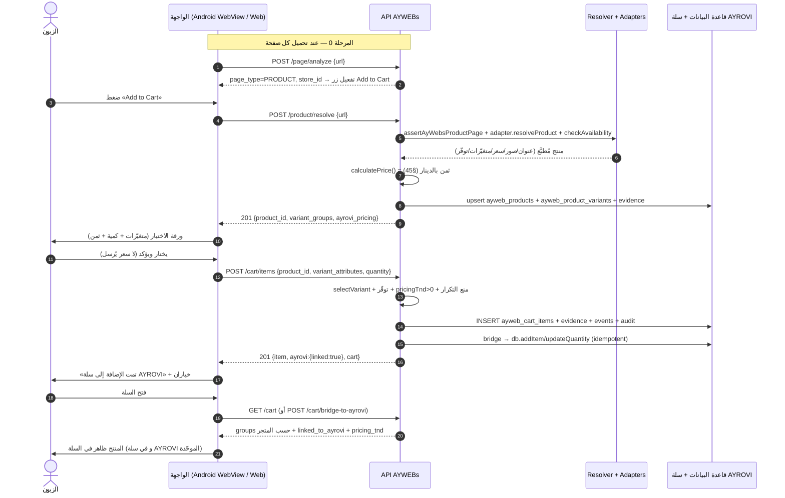

# AYWEBs — مراحل «Add to Cart»: من ضغطة الزر إلى ظهور المنتج في السلة

> **التاريخ:** 2026-10-05 · **الفرع:** `arena/f0cb5a18-ayrovi-beta1`
> **المرجع الملزم:** `docs/AYWEBS_ADD_TO_CART_ORDER.md` (أمر هندسي دائم)
> **تشخيص سابق للإصلاح:** `docs/AYWEBS_ADD_TO_CART_FIX_AR_2026-10-04.md`

هذا الملف **وصفي تنفيذي**: يتتبّع المسار في الكود الفعلي (أندرويد أصلي + ويب + خادم + قاعدة بيانات)،
سطرًا بسطر، من لحظة الضغط على **Add to Cart** إلى ظهور المنتج في **سلة AYROVI**.
كل إشارة `ملف:سطر` يمكن التحقق منها في المستودع.

---

## 0. نظرة عامة — أربعة أطراف

| الطرف | الدور | الملفات |
|---|---|---|
| العميل (أندرويد / ويب) | يعرض المتجر والورقة ويرسل نيّة الإضافة فقط — **لا سعر ولا حالة** | `android/.../AyWebsBrowseActivity.java` · `client/src/features/aywebs/` |
| خادم AYWEBs | يحلّ المنتج، يتحقق من المتغيّرة والتوفّر، **يحسب الثمن**، يكتب السطر | `src/aywebs/routes.ts` · `cart.ts` · `productResolver.ts` |
| محرّك الحلّ (Resolver) | يجلب صفحة التاجر عبر الكاسط + المحوّل (`amazon` / `aliexpress` / `shein` / `temu`) ثم يطبّع | `src/aywebs/adapters/` · `src/aywebs/productNormalizer.ts` |
| قاعدة البيانات + سلة AYROVI | تخزين السطر، الدليل، الأحداث، والجسر نحو نفس السلة الموحّدة | `src/aywebs/schema.ts` · `src/aywebs/ayroviBridge.ts` |

### المسار في سطر واحد

```
ضغط Add to Cart
  → POST /api/v1/aywebs/product/resolve            (حلّ المنتج + تسعير على الخادم)
  → ورقة الاختيار (متغيّرات + كمية + سعر)
  → POST /api/v1/aywebs/cart/items                 (إضافة حقيقية)
  → INSERT في ayweb_cart_items                     (السطر مصدره AYWEBs)
  → جسر idempotent إلى سلة AYROVI                  (نفس السطر في السلة الموحّدة)
  → 201 + شاشة تأكيد من بيانات الخادم
  → GET /api/v1/aywebs/cart                        (المجموعات حسب المتجر + linked_to_ayrovi)
  → «المتابعة إلى صفحة الطلب» → checkout AYROVI
```

> **فرق مهم بين المنصّتين:**
> على **أندرويد** يوجد زرّان: زر «Add to Cart» العائم في شريط المتصفح
> (`AyWebsBrowseActivity.java:256`) ثم زر التأكيد داخل الورقة.
> على **الويب** الورقة تُفتح مباشرة من بطاقة منتج/رابط مُشارَك، وزر «Add to Cart»
> داخلها هو زرّ التأكيد (`AyWebsVariantSheet.tsx:140`).

---

## 1. المراحل التفصيلية

### المرحلة 0 — تفعيل الزر (قبل أي ضغط)

لا يُفعَّل زر «Add to Cart» إلا إذا **صنّف الخادم الصفحة الحالية كصفحة منتج**.

| أين | ماذا يحدث |
|---|---|
| أندرويد | عند كل تحميل صفحة: `POST /api/v1/aywebs/page/analyze` (`AyWebsBrowseActivity.java:378`، المسار معرّف في السطر 77). النتيجة تضبط `productPage` → `setAddEnabled()`. |
| الخادم | `router.post('/page/analyze')` (`src/aywebs/routes.ts:420`) → `analyzeAyWebsUrl(...)` يرجّع `store_id` و`page_type`، ويُسجّل `product_page_detected` في التحليلات. |
| ويب | بطاقة المنتج أو الرابط المباشر يفتحان `AyWebsVariantSheet` (`client/src/features/aywebs/AyWebsApp.tsx` → `onOpenProduct`). |

**قاعدة ثابتة:** لا يوجد «نجاح وهمي». إن لم تكن الصفحة فئة منتج يبقى الزر معطّلًا مع رسالة صريحة.

---

### المرحلة 1 — الضغط على «Add to Cart»

| المنصّة | المدخل | النتيجة |
|---|---|---|
| أندرويد | `addButton.setOnClickListener(v -> onAddToCart())` | **قراءة مُسبقة (05/10/2026):** إن كان المنتج قد رُصد فور فتح صفحته (`prefetchResolve`، نافذة دقيقتين) تُفتح الورقة فورًا بلا شبكة؛ وإلا يُطلب `product/resolve` ويوضع الزر على `Loading…` |
| ويب | `submit()` داخل `AyWebsVariantSheet.tsx:140` | تحقق محلي ثم `addAyWebsCartItem(...)` |

في هذه اللحظة **لا يُرسل أي سعر ولا أي حالة** من العميل؛ فقط نيّة الإضافة.

---

### المرحلة 2 — طلب حلّ المنتج (Client → Server)

```
POST /api/v1/aywebs/product/resolve
{ "url": "https://www.amazon.com/dp/B0GYM3V9H5", "store": "amazon" }   ← المتجر اختياري
```

- المسار: `src/aywebs/routes.ts:470`.
- **يُرفض أي HTML قادم من العميل**: `rejectProvidedPage()` (`routes.ts:123`) يرمي `INVALID_URL`
  بالرمز التقني `RAW_PAGE_CAPTURE_DISABLED`. المبدأ: *العميل يرسل رابطًا، لا يرسل صفحة ولا سعرًا*.
- يسجَّل حدث التحليلات `capture_started`، ثم `capture_succeeded` أو `capture_failed`.

---

### المرحلة 3 — الخادم يقرأ صفحة التاجر ويحسب الثمن

الدالة المركزية: `resolveAyWebsProduct()` — `src/aywebs/productResolver.ts`. خطواتها:

0. **ذاكرة القراءة (05/10/2026)** — `readAyWebsResolveCache` بمفتاح `المتجر + الرابط المُنظَّف` ومدة افتراضية
   5 دقائق (`AYWEBS_RESOLVE_CACHE_TTL_MS`): إن وُجدت قراءة حديثة تُستخدم فورًا (صفر شبكة) مع `from_cache=true`
   و`cache_age_ms`. غير ذلك تُشغَّل قراءة واحدة بسباق متوازٍ (`raceProbes`: جوال + مكتب + قارئ Jina، أول سعر يفوز)،
   وطلبان متزامنان لنفس المنتج يتقاسمان القراءة نفسها (single-flight). `refresh:true` يفرض قراءة جديدة،
   و**مراجعة السلة تفرضه دائمًا**.

1. **`assertAyWebsProductPage`** — التحقق من النطاق المسجَّل ومن أن الصفحة فئة منتج، وضبط `storeId`
   (رفض `STORE_UNKNOWN` و`STORE_MISMATCH` و`PRODUCT_PAGE_REQUIRED`).
2. **المحوّل** — `createAyWebsAdapter(store, scraper)` ثم `adapter.resolveProduct(url)`:
   جلب الصفحة (مع الكاش) واستخراج: العنوان، الصور، السعر، العملة، المتغيّرات، الحالة، معرّف المنتج المصدر.
3. **`adapter.checkAvailability(...)`** — التوفّر يُقرأ من التاجر أو يبقى `UNKNOWN` (لا تخمين).
4. **`calculatePrice(...)`** — **محرّك التسعير AYROVI** يحوّل السعر + الشحن + الديوانة + أتعاب الخدمة
   إلى دينار: `ayrovi_pricing.total_tnd`. هذا هو المبلغ الوحيد الذي «يفعل» (§45).
5. **`ayWebsEvidenceHash(...)`** — بصمة دليل قابلة للتحقق (رابط، سعر، عملة، متغيّرة، توفّر، محوّل، وقت).
6. **`persistAyWebsProduct(...)`** — كتابة/تحديث:
   - `ayweb_products` (`schema.ts:100`)
   - `ayweb_product_variants` (`schema.ts:135`)
   - بصمة الدليل في `ayweb_evidence` (`schema.ts:331`).

الردّ: `201` بحمولة `productPayload()` (`routes.ts:1150`): `product_id`, `title`, `images`, `price`,
`currency`, `variant_groups`, `availability`, `condition`, `ayrovi_pricing.total_tnd`, `evidence_hash`.

---

### المرحلة 4 — فتح ورقة الاختيار (Variant Sheet)

الورقة تُعرض **فوق صفحة التاجر** — لا إعادة توجيه ولا مغادرة للمتجر (بند آمر في `AYWEBS_ADD_TO_CART_ORDER.md`).

| المنصّة | التفصيل |
|---|---|
| أندرويد | `showVariantSheet(product)` — `AyWebsBrowseActivity.java:473`؛ تحقن `R.layout.dialog_aywebs_variant_sheet` في `Dialog` فوق الـ WebView. القيمة الواحدة تُعرض كنص (بيانات لا اختيار)، وكل مجموعة متعددة القيم تُعرض كـ `Spinner`. |
| ويب | `AyWebsVariantSheet.tsx` يقرأ المنتج ثم — **على سبيل أفضل جهد** — يستدعي `POST /product/variants` (`api.ts:415`, المسار `routes.ts:532`) لعرض بطاقات المتغيّرات (صورة/سعر/توفّر لكل قيمة، على طريقة بطاقة أمازون). فشل هذا الاستدعاء لا يُسقط الورقة. |

**شرط الإضافة:**
- أندرويد: `quoteReady = price > 0 && estimateTnd > 0`. إن اختلّ أحد الشرطين: زر التأكيد معطّل + رسالة
  «devis AYROVI indisponible» — **ممنوع** إضافة بلا تسعير خادم.
- ويب: `missingRequired` يمنع التأكيد حتى تُختار كل المجموعات المطلوبة (المجموعات ذات القيمة الواحدة
  تُملأ تلقائيًا لأنها بيانات، لا خيارات).

---

### المرحلة 5 — تأكيد الاختيار → طلب الإضافة الحقيقي

**الجسم المُرسل (نفسه في المنصّتين):**

```
POST /api/v1/aywebs/cart/items
{
  "product_id": "ayw_...",            // الهوية AYROVI المحفوظة في ayweb_products
  "source_url": "https://www.amazon.com/dp/B0GYM3V9H5",
  "store_id": "amazon",
  "variant_attributes": { "color": "Black", "size": "M" },
  "quantity": 1
}
```

- لا `price`، لا `currency`، لا `status`، لا `availability` — كلها يُرفض تجاوزها لأن الخادم يعيد حسابها.
- أندرويد: сбор المتغيّرات من الـ Spinners ثم `POST CART_ITEMS_PATH` (`AyWebsBrowseActivity.java:581`).
- ويب: `AyWebsVariantSheet.tsx:145` → `addAyWebsCartItem` (`client/src/features/aywebs/api.ts:434`).
- التحليلات: العميل يُطلق `add_to_cart_succeeded` (`AyWebsVariantSheet.tsx:154`) بعد نجاح الاستدعاء فقط.

---

### المرحلة 6 — الخادم: الإضافة الفعلية للسطر

**المسار:** `routes.ts:738` (`router.post('/cart/items', optionalAyWebsCustomer(db), ...))`
→ **`addAyWebsCartItem()`** — `src/aywebs/cart.ts:257`.

خطوات الدالة بالترتيب:

| # | الخطوة | التفصيل |
|---|---|---|
| 1 | تسجيل النقرة | `trackAyWebsFunnel('add_to_cart_clicked')` — `routes.ts:741` |
| 2 | تطبيع المدخلات | `normalizeQuantity` (1..99)، `normalizeAttributes`، `sanitizeNote` |
| 3 | إعادة حلّ/قراءة المنتج | `readAyWebsProduct(product_id)`، وإن غاب: `resolveAyWebsProduct(...)` من `source_url` — أي **إعادة قراءة** من التاجر، لا ثقة بحالة قديمة |
| 4 | التحقق من المتجر | `findAyWebsStore` + `flags.storeCaptureEnabled` |
| 5 | **اختيار المتغيّرة** | `selectVariant()` — `cart.ts:489`: مجموعات منشورة بلا اختيار ⇒ `VARIANT_REQUIRED`؛ قيمة غير منشورة ⇒ `VARIANT_UNKNOWN`؛ قيمة غير متاحة ⇒ `VARIANT_UNAVAILABLE` (لا استبدال صامت أبدًا). خاصية `condition` تُحفظ كـ metadata ولا تُستخدم كهوية للمتغيّرة. |
| 6 | **التوفّر** | `OUT_OF_STOCK` ⇒ رفض فوري + حدث `AYWEB_VARIANT_UNAVAILABLE`. `UNKNOWN` مقبول مع نص صريح «سيُتحقق قبل الشراء». |
| 7 | **التسعير إلزامي** | `pricingTnd > 0` وإلا `PRICE_UNAVAILABLE` — لا سطر بلا ثمن |
| 8 | السلة | `getOrCreateAyWebsCart()` — `cart.ts:137` (بالجلسة أو بالحساب)، ورفض إن كانت `CHECKOUT/ORDERED` (`CART_LOCKED`)، وسقف 60 سطرًا |
| 9 | بصمة الدليل + لقطة السعر | `ayWebsEvidenceHash(...)` + `priceSnapshot` كامل (سعر، عملة، متغيّرة، توفّر، `pricingVersion`) |
| 10 | **منع التكرار** | نفس `productId` + نفس المتغيّرة + نفس الملاحظة ⇒ **تحديث الكمية** على السطر نفسه (`quantity += n`) لا سطر ثانٍ. الرد يحمل `duplicate: true`. |
| 11 | **الكتابة** | `INSERT INTO ayweb_cart_items` (كل الأعمدة: `item_number` بصيغة `AYWITEM-…`، `store_id`، `source_url`، `source_product_id`، `title`، `images`، `unit_price`، `currency`، `variant_snapshot`، `quantity`، `availability`، `price_snapshot`، `pricing_tnd`، `evidence_hash`، `status='ACTIVE'`) ثم `refreshCartCounters`. |
| 12 | الأثر | `recordAyWebsEvidence` (الدليل في `ayweb_evidence`)، حدث `AYWEB_CART_ITEM_ADDED` (في `ayweb_domain_events`)، `writeAyWebsAudit` (في `ayweb_audit_logs`)، `logAyWebsOperation('cart_add')` |

`trackAyWebsFunnel('add_to_cart_succeeded')` يُسجَّل في النهاية — `routes.ts:799`.

---

### المرحلة 7 — الجسر إلى سلة AYROVI (داخل نفس الطلب)

بعد نجاح الكتابة، وقبل إرسال الرد، يستدعي المسار الجسر بشكل **محمي**:

```ts
bridgeAyWebsCartToAyrovi(db, { sessionId, accountId, itemIds: [result.item.id], requestId })
```

- `bridgeAyWebsCartToAyrovi` — `src/aywebs/ayroviBridge.ts:66`
- `addAyWebsItemToAyroviCart` — `ayroviBridge.ts:135`:
  - يتحقق من `checkoutReady` و`pricingTnd > 0` (السطر غير الجاهز **لا يعبر الجسر**)
  - ينشئ `createAyrovixPriceToken(...)` (عقد السعر)
  - يمرّر `store`, `externalId`, `url`, `title`, `imageUrl`, `sourcePrice`, `sourceCurrency`,
    `priceTND`, `variant` (تسمية المقاس/اللون)، `customerNote` تحمل معرّف AYWEBs `AYWITEM-…`
  - ينادي `db.addItem(...)` ⇒ **السطر يظهر فعليًا في سلة AYROVI**
- **المنع من المضاعفة:** إن وُجد سطر مطابق مسبقًا (`findAyroviCartLine` — `ayroviBridge.ts:231`، على أساس:
  المتجر + الرابط + المعرّف المصدر + المقاس + اللون) تُحدَّث الكمية إلى مستوى AYWEBs فقط
  (`syncAyWebsItemToAyroviCart` — `ayroviBridge.ts:258`)، **بدون جمع**.
- **الجسر لا يُسقط الإضافة أبدًا:** أي خطأ يُلتقط ويُسجَّل، ويبقى السطر في `ayweb_cart_items`
  مصدرًا، والرد يحمل `ayrovi: { linked:false, reason }`.

الردّ النهائي `201`:

```json
{
  "success": true,
  "data": {
    "item": { "id": "aywci_…", "item_number": "AYWITEM-000123", "title": "…",
              "unit_price": 109, "currency": "USD", "quantity": 1,
              "variant_label": "Color: Black · Size: M", "line_total_tnd": 412.55,
              "checkout_ready": true },
    "duplicate": false,
    "ayrovi": { "linked": true, "cart_item_id": "…", "quantity": 1, "reason": "LINKED" }
  },
  "cart": { "groups": [ /* حسب المتجر */ ], "totals": { "unlinked_units": 0 } }
}
```

---

### المرحلة 8 — واجهة التأكيد («تمت الإضافة»)

| المنصّة | التفصيل |
|---|---|
| أندرويد | `showAddedDialog(item, product)` — `AyWebsBrowseActivity.java:632`. كل المعروض يأتي **من السطر المُعاد من الخادم**: الصورة، العنوان، الخيارات (`variant_label`)، الكمية، `unit_price`، `line_total_tnd`. زرّان فقط: **Checkout** (يفتح `/aywebs/cart`) و**Continue Shopping** (يغلق الورقة ويبقى في المتجر). |
| ويب | `phase === 'added'` في `AyWebsVariantSheet.tsx`: «تمت الإضافة إلى سلة AYROVI» + ملخّص السطر + «متابعة الدفع» و«مواصلة التسوق». إن كان `linked:false` تظهر عبارة صريحة: «محفوظ في سلة AyWebs — ستُؤكَّد الإضافة عند خطوة سلة AYROVI». |

لا إعادة توجيه، لا بطاقة منتج كبيرة، لا بدء تلقائي للدفع — بند آمر في مرجع الـ flow.

---

### المرحلة 9 — ظهور المنتج في السلة

**قراءة السلة:** `GET /api/v1/aywebs/cart` — `routes.ts:726`
→ `readAyWebsCartView()` — `cart.ts:171`:

- `items` = أسطر `ayweb_cart_items` بحالة غير `REMOVED`
- `groups` = **مجموعة حسب المتجر** (`groupByStore` — `cart.ts:205`)
- `totals.units` / `totals.productSubtotalTnd` / `blockers` (الأسطر غير الجاهزة)
- `cartPayload()` — `routes.ts:1287` يُضيف لكل سطر **`linked_to_ayrovi`**
  (عبر `linkedStateFor` → `ayWebsCartLinkedMap` — `ayroviBridge.ts:338`) و**`totals.unlinked_units`**.

**عرض السلة:**
- ويب: `AyWebsCartScreen.tsx` — عنوان، صورة، سعر الوحدة، الخيارات، «موجود بالفعل في سلة AYROVI»،
  الكمية، المجموع الفرعي، و≈ د.ت من `line_total_tnd`، مع بنّرة «يوجد {n} منتجات في سلتك» وإجمالي
  `product_subtotal_tnd` المحسوب على الخادم.
- أندرويد: زرّ **Panier** يفتح **درجًا فوق الـ WebView** (`openListSheet`) — الزبون لا يغادر المتجر.
- السلة موحّدة: لأن الجسر أضاف نفس السطر إلى سلة AYROVI، يظهر المنتج **أيضًا** في صفحة سلة AYROVI
  العادية — قراءة واحدة، لا نسختان.

---

### المرحلة 10 — من السلة إلى الطلب

- زر **«المتابعة إلى صفحة الطلب»** → `bridgeAyWebsCartToAyrovi()` من الواجهة
  (`api.ts:475` → `POST /cart/bridge-to-ayrovi` — `routes.ts:891`): مزامنة idempotent لكل الأسطر
  ثم فتح checkout AYROVI (سلة واحدة، دفع واحد).
- بعد ذلك:
  - تغيير الكمية ⇒ `PATCH /cart/items/:id` -> `updateAyWebsCartItem` (`cart.ts:558`)
    + `syncAyWebsItemToAyroviCart` (تحديث الكمية في السلة الموحّدة).
  - الحذف ⇒ `DELETE /cart/items/:id` -> `removeAyWebsCartItem` (`cart.ts:620`) + إزالة السطر المرتبط
    من سلة AYROVI (لا سطر يتيم).

---

## 2. مخطط التتابع



---

## 3. قاعدة البيانات — ما يُكتب ومتى

| الجدول | متى يُكتب | الحقول المفتاحية |
|---|---|---|
| `ayweb_products` | المرحلة 3 — بعد حلّ المنتج | `store_id`, `source_url`, `title`, `price`, `currency`, `variant_groups`, `availability`, `pricing_tnd`, `evidence_hash` |
| `ayweb_product_variants` | المرحلة 3 — لكل قيمة متغيّرة | `attributes`, `label`, `price`, `availability`, `image` |
| `ayweb_carts` | المرحلة 6 — إن لم توجد سلة `ACTIVE` | `account_id`/`session_id`, `status`, `currency` |
| `ayweb_cart_items` | **المرحلة 6 — لحظة الإضافة الفعلية** | `item_number`, `product_id`, `store_id`, `source_url`, `title`, `images`, `unit_price`, `currency`, `variant_snapshot`, `quantity`, `availability`, `price_snapshot`, `pricing_tnd`, `evidence_hash`, متغيّر `status` (ACTIVE / PRICE_CHANGED / VARIANT_UNAVAILABLE / OUT_OF_STOCK / REMOVED) |
| `ayweb_evidence` | المرحلتان 3 و6 | بصمة الدليل + كل معطيات المصدر وقت الحلّ |
| `ayweb_domain_events` | المرحلة 6 | `AYWEB_CART_ITEM_ADDED` / `AYWEB_CART_ITEM_UPDATED` / `AYWEB_VARIANT_UNAVAILABLE` |
| `ayweb_audit_logs` | المرحلة 6 | `cart_item.add` / `cart_item.update` / `cart.bridge_to_ayrovi` |
| **سلة AYROVI** (`cart_items` عبر `db.addItem`) | المرحلة 7 — الجسر الفوري | نفس عنوان المنتج، السعر بالدينار، المقاس/اللون، وملاحظة تحمل `AYWITEM-…` |

---

## 4. الحالات الخاصة والأخطاء (لا فشل صامت)

| الرمز | متى | ما يراه الزبون |
|---|---|---|
| `INVALID_URL` (`RAW_PAGE_CAPTURE_DISABLED`) | العميل أرسل HTML بدل الرابط | «حدّث التطبيق، أرسل الرابط فقط» |
| `PRODUCT_PAGE_REQUIRED` | الرابط ليس صفحة منتج | إشعار صريح، الزر يبقى معطّلًا |
| `STORE_UNKNOWN` / `STORE_MISMATCH` | متجر غير مسجّل أو تصادم هوية | رفض واضح |
| `PRODUCT_NOT_FOUND` | لا `product_id` ولا `source_url` | رفض واضح |
| `VARIANT_REQUIRED` | مجموعات منشورة بلا اختيار كامل | التأكيد معطّل + توجيه للاختيار |
| `VARIANT_UNKNOWN` / `VARIANT_UNAVAILABLE` | قيمة غير منشورة أو غير متاحة | رفض — **لا استبدال صامت** |
| `OUT_OF_STOCK` | التاجر نشر نفاد المخزون | رسالة «غير متوفر» |
| `PRICE_UNAVAILABLE` | `pricingTnd <= 0` (سعر/عملة/حظر) | إضافة ممنوعة حتى يُضبط الثمن |
| `CART_LOCKED` | السلة في حالة `CHECKOUT/ORDERED` أو > 60 سطرًا | رسالة تصف الحالة |
| `AYWEBS_DISABLED` / `CAPTURE_DISABLED` | الميزة مطفأة | رفض واضح |
| جسر `linked:false` | فشل غير متوقّع في الجسر | السطر باقٍ في AYWEBs + سبب ظاهر + «ستُؤكَّد عند خطوة سلة AYROVI» |

---

## 5. القواعد الثابتة (لا تُخترق في أي تعديل قادم)

1. **الثمن يُحسب على الخادم فقط** (§45) — العميل يرسل منتجًا ومتغيّرة وكمية، لا مبلغًا.
2. **صفحة العميل تُرفض** — الرابط فقط.
3. **لا مغادرة للمتجر** أثناء الإضافة: الورقة فوق الصفحة، والتأكيد ثم خياران.
4. **الزر اسمه «Add to Cart»** — لا أزرار موازية ولا كبيرة overlay.
5. **كل ما يُعرض في التأكيد من السطر الذي يعيده الخادم**، لا من نيّة محلية.
6. **الجسر idempotent**: مزامنة كمية، لا جمع — ضغطتان لا تُنتجان قطعتين.
7. **إضافة بلا تسعير = ممنوعة**، و**لا نجاح وهمي**: التأكيد بعد 2xx فقط.
8. **الأثر الكامل**: دليل + حدث + تدقيق لكل سطر يدخل السلة.

---

## 6. مراجع الملفات بالسطور

| الملف | السطر | ما فيه |
|---|---|---|
| `android/app/src/main/java/app/ayrovi/mobile/AyWebsBrowseActivity.java` | 77 · 78 · 79 | `ANALYZE_PATH` · `RESOLVE_PATH` · `CART_ITEMS_PATH` |
| — | 256 | `addButton.setOnClickListener(v -> onAddToCart())` |
| — | 378 | `POST /page/analyze` وتفعيل الزر |
| — | 433 | `onAddToCart()` — طلب الحلّ |
| — | 473 | `showVariantSheet()` — الورقة فوق المتجر |
| — | 581 | `POST /cart/items` عند التأكيد |
| — | 632 | `showAddedDialog()` — التأكيد من بيانات الخادم |
| `client/src/features/aywebs/components/AyWebsVariantSheet.tsx` | 140 · 145 | `submit()` → `addAyWebsCartItem(...)` |
| `client/src/features/aywebs/components/AyWebsCartScreen.tsx` | — | عرض السلة: مجموعات حسب المتجر · `linked_to_ayrovi` · `Proceed to order page` |
| `client/src/features/aywebs/api.ts` | 415 · 429 · 434 · 475 | `getAyWebsVariants` · `getAyWebsCart` · `addAyWebsCartItem` · `bridgeAyWebsCartToAyrovi` |
| `src/aywebs/routes.ts` | 123 · 420 · 470 · 532 · 726 · 738 | `rejectProvidedPage` · `/page/analyze` · `/product/resolve` · `/product/variants` · `GET /cart` · `POST /cart/items` |
| — | 891 · 1255 · 1287 · 1333 | `/cart/bridge-to-ayrovi` · `cartItemPayload` · `cartPayload` · `linkedStateFor` |
| `src/aywebs/cart.ts` | 137 · 171 · 205 · 257 · 489 | `getOrCreateAyWebsCart` · `readAyWebsCartView` · `groupByStore` · **`addAyWebsCartItem`** · `selectVariant` |
| `src/aywebs/productResolver.ts` | 98 | `resolveAyWebsProduct()` |
| `src/aywebs/ayroviBridge.ts` | 66 · 135 · 231 · 258 · 338 | `bridgeAyWebsCartToAyrovi` · `addAyWebsItemToAyroviCart` · `findAyroviCartLine` · `syncAyWebsItemToAyroviCart` · `ayWebsCartLinkedMap` |
| `src/aywebs/schema.ts` | 100 · 135 · 151 · 164 · 331 · 353 · 366 | `ayweb_products` · `ayweb_product_variants` · `ayweb_carts` · `ayweb_cart_items` · `ayweb_evidence` · `ayweb_domain_events` · `ayweb_audit_logs` |

---

> **زمن الاستجابة (05/10/2026):** أُصلح الانتظار الطويل — التفاصيل والأرقام في
> `docs/AYWEBS_ADD_TO_CART_SPEED_AR.md` (سباق مصادر متوازٍ + ذاكرة قراءة + قراءة مُسبقة في أندرويد).

## 7. التحقق البرمجي

```bash
npm run verify:purchase-flow     # مسار الشراء الكامل في متصفح معزول (سعر/سلة/checkout)
npm run typecheck                # النوعان: الخادم + العميل
npm run test                     # Vitest
npx vitest run tests/scraper-probe-race.test.ts tests/aywebs-resolve-cache.test.ts
```
